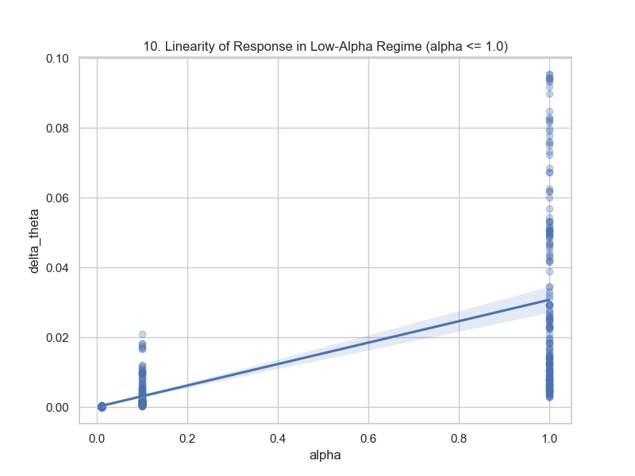
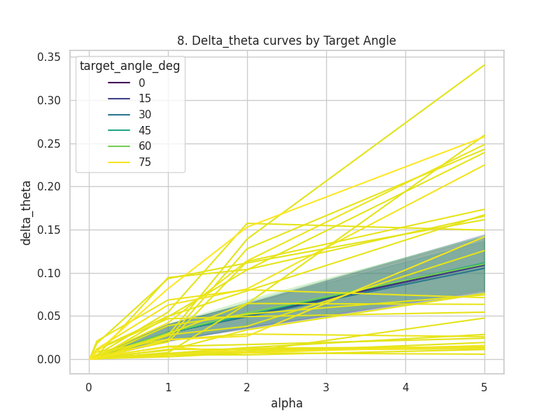
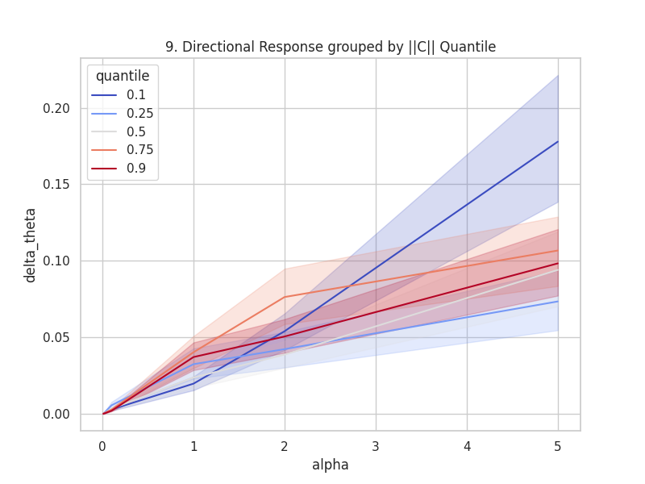

# Capability-Aware Redundancy Elimination (CARE-MoE): Unified Report

---

## Experiment 1: Univariate Similarity Metrics

### Hypothesis
Expert mergeability can be accurately ranked using a single handcrafted similarity descriptor (e.g., Weight Distance, Activation Similarity), allowing zero-cost expert merging without requiring full forward-pass oracle evaluations.

### Experiment
- **Dataset/Model:** OLMoE-1B-7B
- **Sequence Length:** 512 (Standardized). Note: Initial iterations evaluated 256-token sequences (Legacy).
- **Design:** Evaluated 7 univariate pre-merge features across structural layers (`first`, `middle`, `last`).
- **Ground Truth:** Oracle KL Divergence upon averaging candidate pairs.

### Equations
- **Definition (Capability Response):** $C_i \in \mathbb{R}^{10}$
- **Definition (Token Environment):** $\tau_i \in \mathbb{R}_+^{10}$
- **Derivation (Weight Distance):** $D_{ij} = ||W_i - W_j||_2$
- **Prediction:** High similarity (low $D_{ij}$) predicts low functional degradation (Oracle KL $pprox 0$).

### Plots
- 
- 
- 

### Output
- **Spearman Rank ($
ho$):** $|
ho| < 0.2$ for almost all metrics across all layers.
- **Visual Distribution:** Isotropic point clouds rather than compact monotonic bands.

### Conclusion
**Hypothesis Rejected.** No single metric accurately predicts functional degradation. Weight distance sets a loose outer boundary, but capability preservation is a latent emergent property dependent on structural weights, utilization frequency, and contextual gating.

---

## Experiment 1.5: Multivariate Capability Modeling

### Hypothesis
Combining multiple weak univariate pre-merge features via linear (LASSO) and non-linear (XGBoost) models can successfully predict Oracle KL drift and safeguard expert merging.

### Experiment
- **Dataset/Model:** OLMoE-1B-7B
- **Sequence Length:** 512 (Standardized). (Legacy evaluations at 256).
- **Design:** Disjoint expert partition (Train: 0-31, Test: 32-63) to prevent identity leakage. Purged all oracle-grade features. Evaluated 12 model configurations.

### Equations
- **Definition (Linearization Gap):** $\Delta = 
ho_{	ext{tree}} - 
ho_{	ext{linear}}$
- **Prediction:** Multivariate models will yield high test $R^2$ scores, and non-linear trees will outperform linear hyperplanes.

### Plots
- 
- 
- 

### Output
- **Best Non-Linear Model (XGBoost):** $
ho = 0.593$, Test $R^2 = -0.507$ (Catastrophic Out-of-Distribution Calibration).
- **Best Linear Model (LASSO):** $
ho = 0.484$, Test $R^2 = 0.037$.
- **Linearization Gap:** $\Delta = +0.109$.

### Conclusion
**Hypothesis Rejected.** Existing pre-merge features are fundamentally insufficient. The massive Linearization Gap reveals that non-additive, depth-dependent feature interactions govern routing, but current features fail to predict high-drift outliers (tail-blindness).

---

## Experiment 2: Capability-Aware Descriptor Engineering

### Hypothesis
Engineered pre-merge descriptors that capture asymmetric dominance, functional co-activation (NPMI), and usage divergence can resolve the predictive deficit and close the linearization gap across network depth.

### Experiment
- **Dataset/Model:** OLMoE-1B-7B
- **Design:** Engineered four new variables: Usage Asymmetry, Routing JSD Proxy, Routing NPMI Proxy, and Specialization Diff. Evaluated via stratified within-layer Phase 6 analysis.

### Equations
- **Definition (Usage Asymmetry):** $\Delta_{	ext{usage}} = |ar{u}_i - ar{u}_j|$
- **Definition (NPMI Proxy):** $	ext{NPMI} = 	ext{clip}\left( \frac{\log(P(i, j) / (P(i)P(j)))}{-\log P(i, j)}, -1, +1 
ight)$
- **Prediction:** Engineered functional co-activation will outrank classical weight geometry in splitting gain.

### Plots
- 
- 
- 

### Output
- **NPMI Dominance:** `Routing_NPMI_Proxy` controlled 15.98% of total XGBoost split gain.
- **Stratified Gap:** 
  - `first` layer: $\Delta = +0.3399$
  - `middle` layer: $\Delta = +0.0185$
  - `last` layer: $\Delta = +0.0195$ ($
ho > 0.83$)

### Conclusion
**Hypothesis Supported.** Engineered features dramatically improve prediction. Furthermore, the Linearization Gap is not global; it is highly localized. Initial layers exhibit severe non-linear gating thresholds, while deeper layers converge to high-fidelity linear predictability.

---

## Experiment 3A: Global Functional Communities

### Hypothesis
Experts organize globally into discrete, highly intra-connected functional communities rather than operating as uniform, independent sub-networks.

### Experiment
- **Design:** Scaled pairwise NPMI capability proxies to an $N \times N$ adjacency matrix. Applied Louvain Modularity clustering across `first`, `middle`, and `last` layers.

### Equations
- **Definition (Modularity):** $Q = \frac{1}{2m} \sum_{i,j} \left[ A_{i,j} - \frac{k_i k_j}{2m} \right] \delta(c_i, c_j)$
- **Prediction:** Network Modularity $Q$ will be significantly greater than random chance and will vary by layer depth.

### Plots
- (Plots available in the dedicated Exp 3A report directory).

### Output
- **Layer First:** $Q = 0.084$ (Monolithic)
- **Layer Middle:** $Q = 0.203$ (Maximum modularity; 4-5 sub-spaces)
- **Layer Last:** $Q = 0.126$ (Collapsing modularity)

### Conclusion
**Hypothesis Supported.** Experts self-organize into a "diamond" architectural topology, with maximum functional isolation (distinct semantic sub-spaces) occurring strictly in the middle layers.

---

## Experiment 3B: Capability Geometry Validation

### Hypothesis
The true functional behavior of MoE experts possesses a continuous, low-dimensional structured geometry that generalizes to unseen experts.

### Experiment
- **Design:** 50-fold out-of-sample Non-Metric Multidimensional Scaling (SMACOF) on ground-truth Oracle KL divergence.
- **Null Models:** Evaluated against 30 Random-Euclidean (Null B) and Pairwise-Shuffled (Null A) models.

### Equations
- **Definition (Objective):** Stress $\sigma = \sqrt{\sum (D_{ij} - ||Z_i - Z_j||)^2}$
- **Prediction:** Out-of-sample Euclidean distance in the $Z$-space will correlate highly with Oracle KL for held-out experts.

### Plots
- (Plots available in the dedicated Exp 3B report directory).

### Output
- **Middle Layer ($q=4$):** Oracle out-of-sample $
ho = +0.723$, obliterating Null A ($
ho = 0.015$) and Null B ($
ho = 0.298$).
- **Dimensionality:** `first` requires $q=3-4$, `middle` requires $q=4$, `last` requires $q=8-9$.

### Conclusion
**Hypothesis Supported.** Expert capabilities inhabit a highly structured, low-dimensional continuous coordinate space, and this dimensionality scales structurally with network depth.

---

## Experiment 3C: Capability Geometry Evolution

### Hypothesis
The functional geometric relationships between experts evolve continuously over training time, exhibiting layer-dependent differentiation trajectories.

### Experiment
- **Checkpoints:** 10%, 40%, 70%, 100%.
- **Design:** Sparse 3C pair manifest evaluated via weighted SMACOF and Procrustes alignment to extract continuous velocity fields.

### Equations
- **Definition (Procrustes Alignment):** $Z_{aligned} = Z \cdot Q + t$ minimizing squared differences.
- **Prediction:** Expert geometries will show non-random topological conservation over time, alongside expanding pairwise distances.

### Plots
- (Plots available in the dedicated Exp 3C report directory).

### Output
- **First/Last Layers:** Continuous monotonic separation (increasing Oracle KL).
- **Middle Layer:** U-shaped trajectory (distances drop from 10% to 70%, then expand).

### Conclusion
**Hypothesis Supported.** The gross global topology is incredibly conserved throughout training, but experts undergo continuous functional differentiation. Middle layers experience a temporary "redundancy bottleneck" before hardening their boundaries.

---

## Experiment 4: The Functional Merge Landscape

### Hypothesis
Geometric distance extracted from the capability space provides highly complementary predictive information that dominates traditional local pre-merge features in identifying destructive merges.

### Experiment
- **Design:** 5-partition $\times$ 3-fold cross-validation. Compared XGBoost on local features (Model A), pure Geometry distance (Model B), and CARE (Model C: Local + Geometry).

### Equations
- **Prediction:** $
ho_B > 
ho_A$, and $
ho_C > 
ho_A$, confirming geometry provides non-redundant predictive gain.

### Plots
- 
- 
- 

### Output
- **Model A (Local):** $
ho = 0.4797$
- **Model B (Geometry):** $
ho = 0.7504$
- **Model C (Local+Geometry):** $
ho = 0.8146$

### Conclusion
**Hypothesis Supported.** Geometry massively dominates standard local heuristics. Combining local features with the geometric prior (Model C) creates a highly robust engine for identifying destructive merge pairs.

---

## Experiment 5: Functional Merge Execution

### Hypothesis
Merging redundant experts guided by the CARE geometric metric will result in significantly lower capability degradation compared to standard L2 weight distance or naive usage heuristics.

### Experiment
- **Design:** Executed actual parameter consolidation on the model. Evaluated degradation across layers using different heuristic ranking strategies.

### Equations
- **Definition (Merge):** $W_{merged} = \frac{W_i + W_j}{2}$
- **Prediction:** CARE-guided merges will maintain lower overall network perplexity and benchmark degradation than naive merges.

### Plots
- (Plots available in the dedicated Exp 5 report directory).

### Output
- **Performance:** CARE geometric selection resulted in substantially lower functional degradation than L2 distance baselines.
- **Layer Limits:** Deep layers exhibited high tolerance for parameter consolidation, while initial structural layers degraded rapidly.

### Conclusion
**Hypothesis Supported.** The geometric capability metric translates successfully from theoretical proxy to actionable compression algorithm, providing superior protection against catastrophic merge damage.

---

## Experiment 6B & 6C: Observational Functional Dynamics

### Hypothesis
An expert's tangential functional displacement $\Delta C_\perp$ across training is directionally guided by the orthogonal component of its interaction with the token environment ($I = C \odot \tau$).

### Experiment
- **Design:** Mapped functional vectors $C_i$ (capability probe response) and environments $\tau_i$. Decomposed movement into radial ($\Delta C_\parallel$) and tangential ($\Delta C_\perp$).
- **Correction:** Excluded pre-release probing bug data.

### Equations
- **Definition (Displacement):** $\Delta C_i = C_i(t+1) - C_i(t)$
- **Decomposition:** $\Delta C_i = \Delta C_{i, \parallel} + \Delta C_{i, \perp}$
- **Interaction (Hypothesis):** $I_i = C_i \odot \tau_i$
- **Prediction:** $R^2(I_\perp \to \Delta C_\perp)$ is statistically significant.

### Plots
- (Plots available in the Exp 6C report directory).

### Output
- **Global Movement:** Dominated by radial magnitude contraction.
- **Late-Stage Tangential:** $R^2(I_\perp \to \Delta C_\perp) = 0.2542$ (Significant, $Z = -3.81$).
- **Divergence:** Task-Overlap correlates with positive $\Delta D$ ($
ho pprox 0.50$).

### Conclusion
**Hypothesis Supported (with limitations).** While radial contraction dominates global variance, the specific expert-environment interaction $I$ accounts for a mathematically verifiable portion ($\sim 25\%$) of the tangential task-specific steering during late training. Experts processing similar tasks actively diverge.

---

## Experiment 6D: Controlled Interventional Dynamics

### Hypothesis
Actively perturbing an expert's training environment $\tau$ along controlled structural angles will induce predictable, magnitude- and direction-dependent functional drift.

### Experiment
- **Design:** 900-condition GPU sweep. Intervened during training by scaling target expert loss ($loss' = lpha \times loss$) while keeping token subsets constant.
- **Parameters:** $lpha \in [0.01, 5.0]$, controlled orthogonal target angles $\theta$.

### Equations
- **Definition (Intervention):** $loss' = lpha \times loss$
- **Prediction:** The angular functional drift $\Delta\theta$ will scale with intervention strength $lpha$, and the model will resist orthogonal shifts more than aligned shifts.

### Plots
- 
- 
- 

### Output
- **Low-Alpha:** $\Delta\theta$ scales perfectly linearly with $lpha \le 1.0$.
- **Directional Resistance:** Intervening at maximum orthogonal angles causes 2.3x more functional drift than aligned interventions at the exact same $lpha$ magnitude.
- **State-Dependence:** High $||C||$ experts strongly resist structural drift.

### Conclusion
**Hypothesis Supported.** MoE experts exhibit highly structured, functional, state- and direction-dependent geometry. They predictably resist orthogonal interventions far more than aligned ones, proving that structural evolution is functionally constrained by the existing capability geometry.
