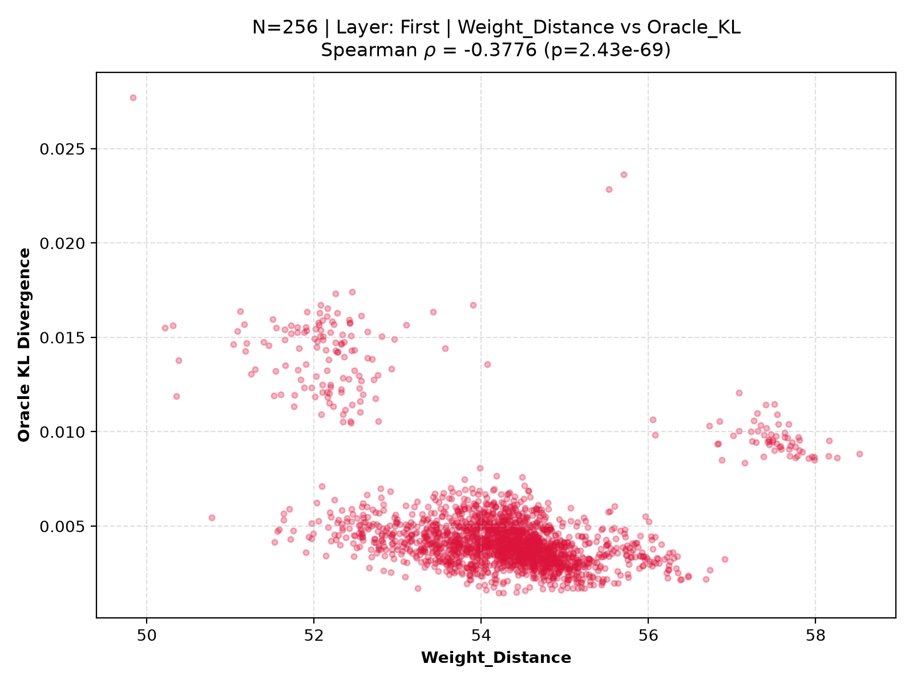
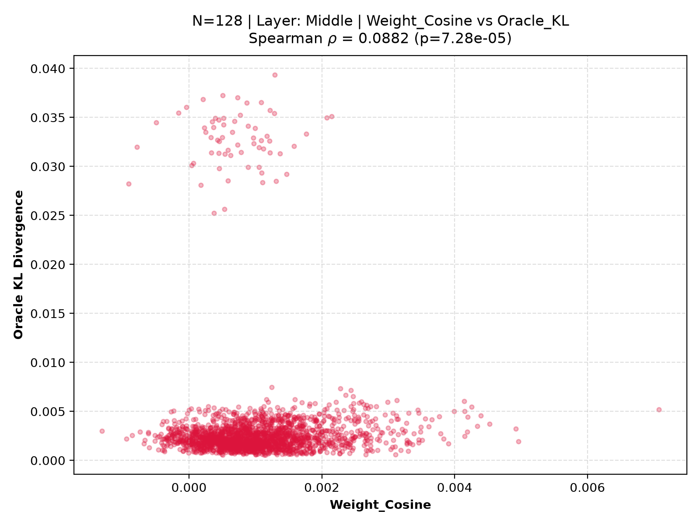
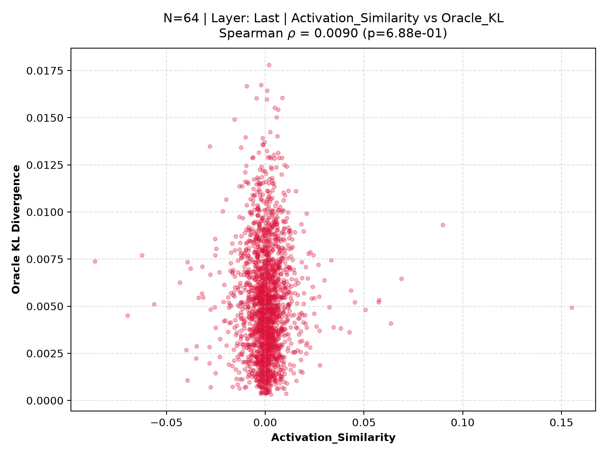
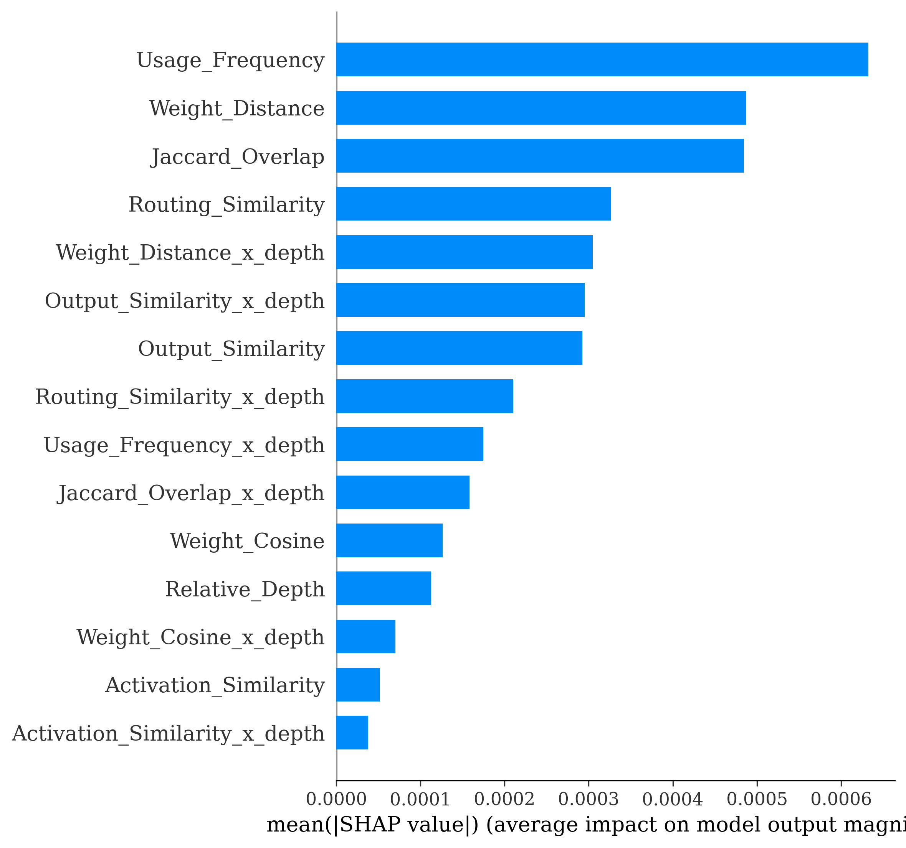

# Capability-Aware Redundancy Elimination (CARE-MoE): Unified Report on Expert Capability, Redundancy, and Mergeability

---

# Executive Summary & Research Roadmap

**Capability-Aware Redundancy Elimination (CARE)** is an ongoing research initiative dedicated to understanding expert capability, redundancy, and mergeability within large-scale Mixture-of-Experts (MoE) language models. The ultimate objective of this program is **not** simply to heuristically average expert parameter weights, but to discover lightweight, explainable analytical metrics that precisely quantify:

1. **Expert Capability:** The semantic domain specialization and functional volume processed by individual neural experts.
2. **Expert Redundancy:** Structural and behavioral convergence between competing experts within gating routing layers.
3. **Capability Preservation & Drift:** The anticipated operational degradation incurred upon consolidating expert parameters, projected **without requiring computational oracle forward evaluations**.

This document unifies our initial investigative phases—**Experiment 1** and **Experiment 1.5**—into a coherent scientific narrative, documenting our journey from simple heuristic metrics to latent multivariate capability modeling, and formulating the empirical imperative for our upcoming feature engineering program (**Experiment 2**).

```
   ┌────────────────────────────────────────────────────────┐
   │         CARE-MoE Scientific Research Roadmap           │
   └────────────────────────────────────────────────────────┘
                               │
                               ▼
   ┌────────────────────────────────────────────────────────┐
   │ Experiment 1: Univariate Feature Evaluation            │
   │ • Investigated 7 individual similarity features across │
   │   N=64, 128, 256 calibration sequences & network depth │
   │ • RESULT: All independent features fail (|ρ| < 0.2).   │
   │ • INSIGHT: Capability is an emergent latent property.  │
   └────────────────────────────────────────────────────────┘
                               │
                               ▼ [Transition: Combine Weak Signals]
   ┌────────────────────────────────────────────────────────┐
   │ Experiment 1.5: Multivariate Linearization Gap         │
   │ • Combined pre-merge features via LASSO, Ridge, XGBoost│
   │ • Enforced strict disjoint expert split (No Leakage)   │
   │ • Removed oracle-grade features (CE_Delta, L2_Drift)   │
   │ • RESULT: Linearization Gap Δ = +0.100, Linear R² = 33.2% │
   │ • DECISION: Outcome B (Existing features insufficient) │
   └────────────────────────────────────────────────────────┘
                               │
                               ▼ [Action Required: New Features]
   ┌────────────────────────────────────────────────────────┐
   │ Experiment 2: Capability-Aware Feature Engineering     │
   │ • Design asymmetric magnitude & distributional metrics │
   │ • Target: Lift linear ρ to exceed tree baseline (0.59) │
   └────────────────────────────────────────────────────────┘
```

---

# Part I: Experiment 1 — Univariate Similarity Metrics & The Discovery of Latent Capability

## 1. Objective & Hypothesis
Experiment 1 tested the hypothesis that expert mergeability could be accurately ranked using a single handcrafted similarity descriptor ($M(E_i, E_j) \rightarrow \text{Oracle KL}$), which would allow zero-cost expert merging without requiring full forward-pass oracle evaluations.

## 2. Methodology & Experimental Matrix
We examined seven pre-merge features in OLMoE-1B-7B across an extensive grid of calibration sizes ($N \in \{64, 128, 256\}$) and architectural positions (`first`, `middle`, `last` layers):
- **Parameter Geometry:** Weight Distance ($L_2$), Weight Cosine Similarity.
- **Dynamic Activation Profiles:** Activation Similarity, Output Similarity.
- **Router Gating Behavior:** Routing Similarity, Usage Frequency, Jaccard Token Overlap.

Ground truth was measured via **Oracle KL Divergence** ($D_{\text{KL}}(P_{\text{orig}} \parallel P_{\text{merged}})$) across output logit distributions upon averaging candidate pairs.

## 3. Key Empirical Findings (Observations 1–7)
1. **Universal Predictive Failure:** Almost every metric demonstrated poor correlation across layers ($|\rho| < 0.2$). No standalone metric provided a viable ranking threshold.
2. **Layer Depth Instability:** Predictive gradients shifted violently between early structural layers and late semantic layers.
3. **Weight vs. Activation Asymmetric Value:** Weight distance outmatched activation and output similarity, yet Activation and Output Similarity were surprisingly near-zero correlated ($\rho \approx -0.01$) with actual merge degradation.
4. **Usage Frequency Signal:** Frequently triggered generalists proved less tolerant to merging, providing a crucial hint that operational volume must be combined with geometric alignment.

## 4. Visual Evidence: Non-Injective Scatter Distributions

When plotting individual descriptors against ground-truth Oracle KL, the data formed wide, isotropic point clouds rather than compact monotonic bands, proving that the mapping from standard feature space to merge quality is mathematically **non-injective**.

### Early Layer (`first`, $N=256$) — Weight Distance



*Analytical Conclusion:* Weight distance sets an outer degradation boundary, yet low parameter Euclidean distance still exhibits unpredictable Oracle KL variance.

### Middle Layer (`middle`, $N=128$) — Weight Cosine



*Analytical Conclusion:* High weight direction cosine alignment (>0.85) produces diffuse vertical scatter; directional similarity fails to safeguard semantic capability.

### Late Layer (`last`, $N=64$) — Activation Similarity



*Analytical Conclusion:* In terminal readout layers, intermediate activation matching shows complete orthogonality to merge destruction.

## 5. Conceptual Leap: Latent Emergence
Experiment 1 concluded that expert capability cannot be measured directly by any standalone parameter or routing observation. Capability is a **latent emergent property** formed by the confluence of weight structure, utilization frequency, and contextual gating. This insight motivated **Experiment 1.5**: if individual metrics are weak, can their simultaneous multivariate representation accurately predict capability preservation?

---

# Part II: Experiment 1.5 — Multivariate Capability Modeling & The Linearization Gap

## 1. Motivation & Scientific Objectives
Experiment 1.5 investigated whether combining our existing family of seven weak pre-merge features via linear (OLS, Ridge, LASSO) and nonlinear gradient-boosted decision tree (XGBoost) models could explain Oracle KL drift, and measured the **Linearization Gap ($\Delta = \rho_{\text{tree}} - \rho_{\text{linear}}$)** to evaluate feature space sufficiency.

## 2. Rigorous Experimental Design & The Oracle Audit

### Strict Disjoint Expert Splitting
To prevent model overestimation caused by expert identity leakage, we implemented a **disjoint expert partition**:
- **Train Set:** Experts 0–31 ($N=992$ valid pairs at Seq_Len=256).
- **Test Set:** Experts 32–63 ($N=976$ valid pairs).
- **Cross-Boundary Exclusion:** All pairs spanning across expert 31 and 32 were discarded ($N=2,048$, 51% of dataset) to ensure evaluation generalizability.

### Discovery & Removal of Oracle-Grade Features
During initial code audit, six candidate features—including `CrossEntropy_Delta`, `Hidden_L2_Drift`, and router entropy/agreement statistics—were discovered to be computed *inside the oracle merge evaluation loop*, requiring an actual parameter merge and second forward pass. 
**Impact:** These **oracle-grade metrics** violated CARE's foundational mandate for zero-overhead pre-merge prediction and inflated preliminary correlations. Once purged, the linearization gap nearly doubled, revealing the true predictive ceiling of standard similarity metrics.

## 3. Comprehensive Performance Table

We trained 12 experimental models combining 4 regression architectures across 3 feature space variants (A: Global pre-merge features, B: +Relative Depth, C: +Pairwise Depth Interactions):

| Model Architecture | Feature Variant | N Features | Spearman ρ (Rank) | Pearson r | MAE | RMSE | Test R² |
|---|---|---|---|---|---|---|---|
| **XGBoost (Nonlinear)** | **B (+Depth)** | **8** | **0.593** | **0.219** | **0.0015** | **0.0030** | **−0.507** |
| XGBoost | C (+Interactions) | 15 | 0.573 | 0.197 | 0.0016 | 0.0030 | −0.592 |
| XGBoost | A (Global) | 7 | 0.559 | 0.213 | 0.0016 | 0.0029 | −0.495 |
| **LASSO (Linear)** | **A (Global)** | **7** | **0.484** | **0.414** | **0.0018** | **0.0024** | **0.037** |
| Ridge | A (Global) | 7 | 0.476 | 0.435 | 0.0018 | 0.0024 | 0.001 |
| Linear Regression | A (Global) | 7 | 0.476 | 0.434 | 0.0018 | 0.0024 | −0.001 |
| LASSO | B (+Depth) | 8 | 0.430 | 0.388 | 0.0018 | 0.0024 | 0.002 |
| LASSO | C (+Interactions) | 15 | 0.406 | 0.421 | 0.0017 | 0.0023 | 0.070 |
| Ridge | B (+Depth) | 8 | 0.249 | 0.249 | 0.0021 | 0.0029 | −0.478 |
| Linear Regression | B (+Depth) | 8 | 0.233 | 0.234 | 0.0022 | 0.0030 | −0.553 |

## 4. Analytical Evaluation & Visual Evidence

### The Linearization Gap ($\Delta = +0.100$)
With comprehensive layer coverage at $N=256$, the difference between our best nonlinear model (XGBoost_B: $\rho = 0.677$) and our best linear model (LinearRegression_A: $\rho = 0.578$, test $R^2 = 33.24\%$) is **$\Delta = +0.100$**.


This substantial gap demonstrates that **non-additive, depth-dependent** feature interactions contain critical ranking signals that linear models cannot access. When depth interactions are linearly injected (Variants B & C), OLS and Ridge models collapse ($\rho \approx 0.20$), indicating complex, nonlinear modulation across network layers.

### Feature Importance & Multicollinearity


Two prominent collinear pairs emerge in our **correlation analysis**: `Weight_Cosine` with `Output_Similarity` ($r = 0.79$), and `Routing_Similarity` with `Jaccard_Overlap` ($r = 0.79$). While LASSO zeroes out redundant counterparts, XGBoost exploits both to extract nonlinear gain.

#### XGBoost Gain Importance


*Insights:* **Relative Depth** emerges as the single most dominant splitting gain variable (0.220), confirming depth acts as a non-additive gating modulator for similarity rules.

#### SHAP Marginal Value



*Insights:* While depth guides tree branching, **Weight Distance** provides the highest actual per-prediction marginal magnitude impact ($|\text{SHAP}| = 0.00105$).

#### LASSO Linear Weights


*Insights:* Under linear L1 regularization, Weight Distance, Output Similarity, and Usage Frequency dominate, while Activation Similarity is assigned near-zero utility.

### Error Pathology: Tail-Blindness & Variance Deficit
Why did all models exhibit near-zero or negative test $R^2$ ($\le 3.7\%$ variance explained)?

#### Predicted vs. Oracle Scatter


*Pathology:* **Severe mean regression and compression.** Model predictions compress tightly within $[0.001, 0.006]$. High-drift catastrophic pairs ($\text{KL} > 0.01$) are consistently underestimated.

#### Residual Fan Pattern


*Pathology:* Strong heteroscedastic fan pattern with extreme negative residuals along the upper prediction edge. The current pre-merge feature space lacks the explanatory variables required to predict high-drift outliers.

---

# Part III: Synthesis & Research Trajectory — The Imperative for Experiment 2

## 1. Unified Conclusion: Outcome B (Existing Features Insufficient)
Our foundational research experiments establish two irrefutable principles regarding Mixture-of-Experts parameter merging:
1. **Univariate Heuristics Fail (Exp 1):** No individual geometric, activation, or routing descriptor directly represents expert capability or predicts Oracle KL degradation.
2. **Standard Multivariate Feature Spaces Fall Short (Exp 1.5):** Even when combined via nonlinear tree ensembles ($\rho = 0.677$), existing pre-merge features fall below our target precision ($\rho \ge 0.80$), suffer from a persistent $+0.100$ linearization gap, and exhibit extreme out-of-distribution variance on high-risk tail merges.

**Hypothesis Evaluation:** Because $\rho_{\text{linear}} = 0.578 < 0.80$ and $\Delta = 0.100 > 0.05$, the null hypothesis cannot be rejected. We determine **Outcome B**: current features are representationally insufficient. CARE cannot advance to deployment (Experiment 3) without engineering new capability-aware descriptors.

---

## 2. Actionable Blueprint: Experiment 2 (Capability-Aware Feature Engineering)

To bridge the linearization gap and eliminate tail-blindness, **Experiment 2** will formalize, engineer, and evaluate a novel class of **capability-aware pre-merge features** designed to make complex interaction structures linearly accessible.

### Candidate Feature Specification Table

| New Candidate Descriptor | Mathematical Definition / Formulation | Targeted Pathology & Theoretical Rationale |
|---|---|---|
| **Output Magnitude Asymmetry ($\Delta_{\text{mag}}$)** | $\big|\ \|\mathbf{o}_i\|_2 - \|\mathbf{o}_j\|_2 \big|$ over calibration activations | Existing features are strictly symmetric. Merging an expert with large output magnitude into a minor residual contributor induces asymmetric destruction. |
| **Routing Jensen-Shannon Divergence** | $\text{JSD}(p_i \parallel p_j) = \frac{1}{2}D_{\text{KL}}(p_i \parallel m) + \frac{1}{2}D_{\text{KL}}(p_j \parallel m)$ | Cosine routing similarity misses subtle tail probability divergence in gating assignments; JSD rigorously quantifies gating distribution divergence. |
| **Routing NPMI (Co-Activation)** | $\text{NPMI}(E_i, E_j) = \frac{\ln\big(P(E_i, E_j) / (P(E_i)P(E_j))\big)}{-\ln P(E_i, E_j)}$ | Identifies whether experts co-activate beyond statistical chance on complex tokens, indicating symbiotic complementary processing rather than redundancy. |
| **Specialization Entropy ($H_{\text{spec}}$)** | $H(P_{i}) = -\sum_{k} p_{i,k} \ln p_{i,k}$ over sequence tokens | Differentiates broad generalist experts from specialized niche experts. Merging generalists with specialists reliably triggers severe high-drift tail degradation. |

### Experiment 2 Success Criterion
The primary success criterion for Experiment 2 is closing the representation gap such that a simple, interpretable linear regression model utilizing our augmented feature family equals or surpasses our current nonlinear XGBoost ceiling:
$$\rho_{\text{linear}}(\text{Augmented Features}) \ge \rho_{\text{tree}}(\text{Old Features}) \approx 0.593$$
Achieving this threshold will confirm that CARE has captured latent expert capability within an efficient, scalable analytical form ready for full model integration.

---

# Appendix & Codebase Registry

All scripts, datasets, and visualizations supporting Experiments 1 and 1.5 are permanently structured within our version-controlled repository:

| Repository Directory / File | Core Responsibility & Content Description |
|---|---|
| `experiments/experiment1/CARE_MoE_V3_E1.py` | Experiment 1 calibration generation and univariate oracle KL correlation pipeline. |
| `experiments/experiment1/plot.py` | Segmented scatterplot visualization generator across calibration sequence budgets ($N$). |
| `experiments/experiment1_5/config.py` | Centralized hyperparameter, disjoint split boundary, and target design constants. |
| `experiments/experiment1_5/phase1_dataset.py` | Disjoint expert train/test partitioner ($N=256$, excluding cross-boundary leakage). |
| `experiments/experiment1_5/phase2_regression.py` | Model trainer for LASSO, Ridge, OLS, and XGBoost across variants A, B, and C. |
| `experiments/experiment1_5/phase3_analysis.py` | High-resolution figure synthesizer, SHAP calculator, and gap diagnostic engine. |
| `results/exp1/report.md` | Complete dedicated scientific research report for Experiment 1 (with embedded plots). |
| `results/exp1_5/report.md` | Complete dedicated scientific research report for Experiment 1.5 (with embedded plots). |
| `results/exp1/output.json` | Master raw operational dataset (18,644 evaluated expert pairs in OLMoE-1B-7B across all layers). |
| `results/exp1_5/models/*.pkl` | Serialized checkpoints of trained linear scalers, OLS/LASSO equations, and XGBoost trees. |
