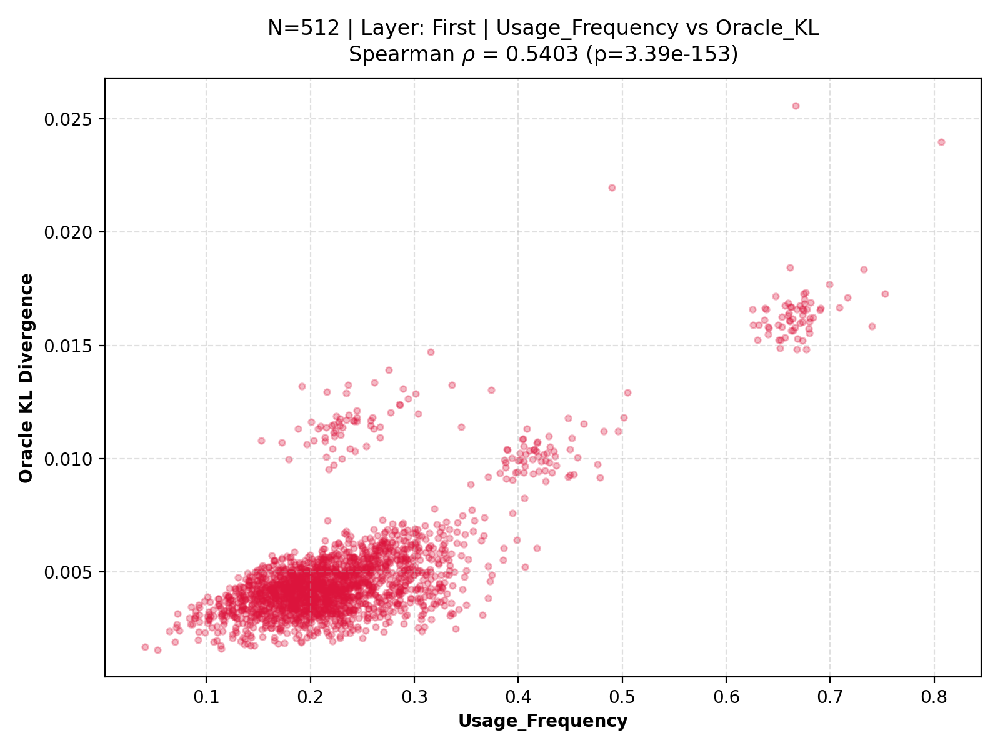
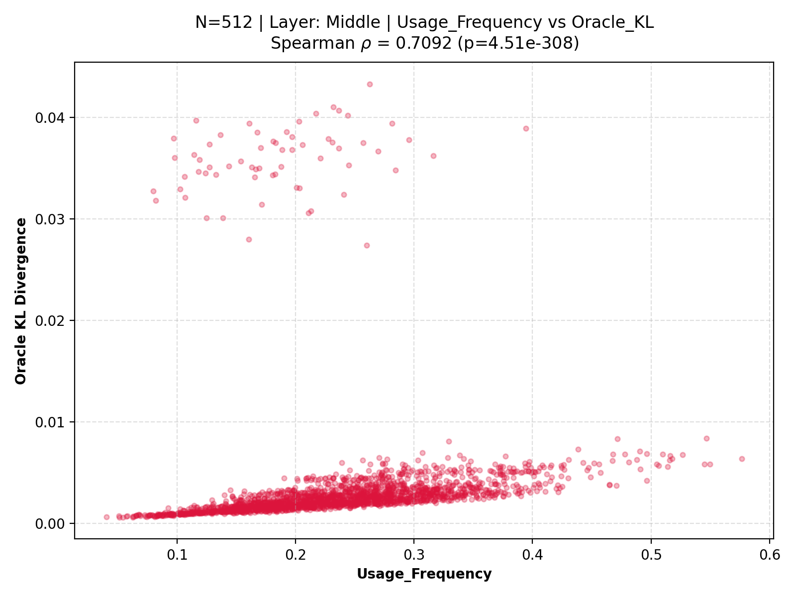
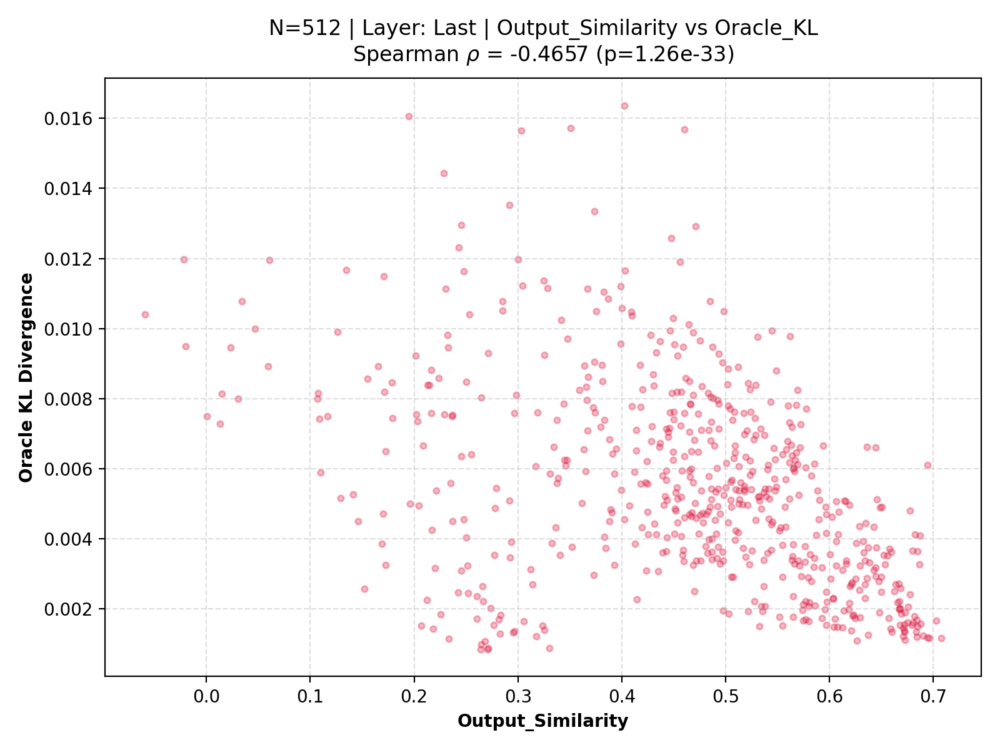
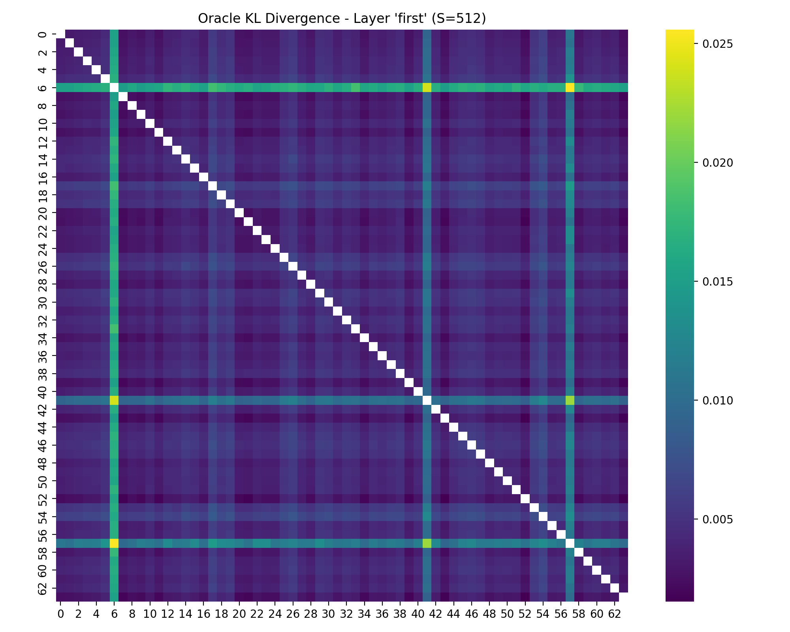
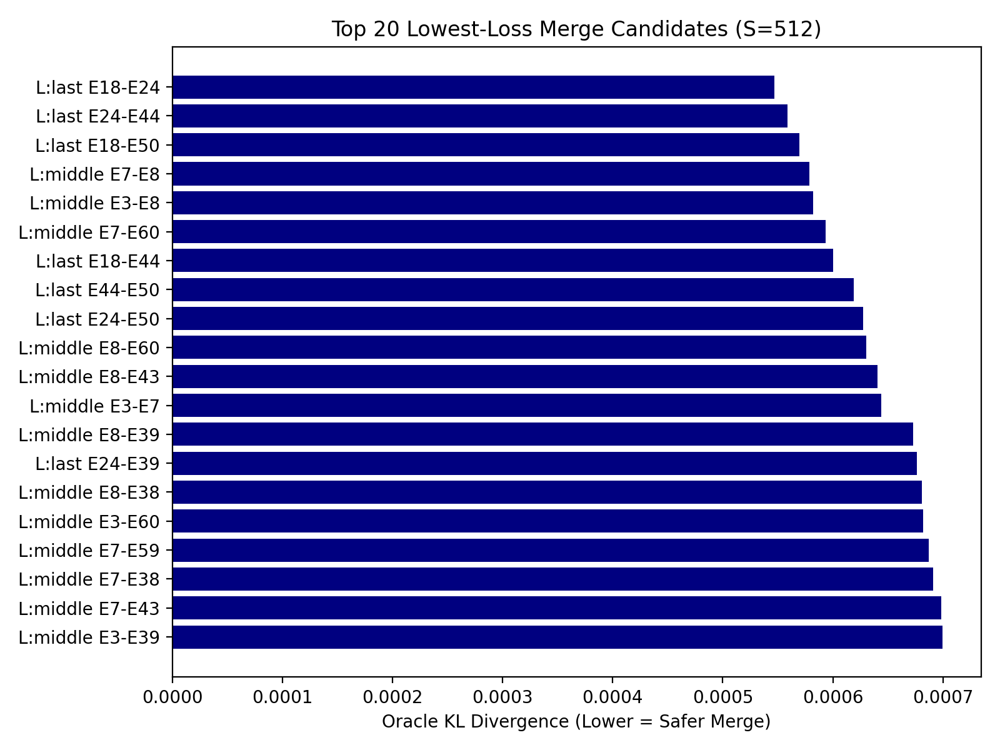

# Experiment 1: Statistical Characterization of Expert Mergeability

### Hypothesis

## 1. Objective

The primary objective of Experiment 1 is to statistically characterize the mergeability of expert parameters within the OLMoE-1B-7B architecture. Rather than relying on expensive oracle evaluations for every possible expert pairing, we seek to determine whether expert mergeability is governed by observable structural and functional properties. Furthermore, this study aims to rigorously analyze how these predictive properties evolve across network depth (from early to terminal layers) and remain robust as the calibration token budget scales. By conducting exhaustive pairwise merge evaluations, we aim to map the relationship between heuristic similarity metrics and the empirical cost of parameter consolidation.

## 2. Final Hypotheses

Based on our complete experimental findings, we formulate the following defining hypotheses regarding expert mergeability:

1. **Mergeability is Not Random:** The operational degradation (Oracle KL divergence) incurred by merging two experts is governed by measurable behavioral and structural properties rather than random parameter variation.
2. **Layer-Dependent Evolution:** The relationships between expert descriptors and mergeability are not static; rather, they evolve systematically across transformer depth as representations transition from structural processing to semantic refinement.
3. **Intrinsic Organizational Properties:** If statistical relationships between similarity descriptors and merge cost remain consistent across progressively scaling calibration lengths ($N = 64 \rightarrow 128 \rightarrow 256 \rightarrow 512$), then these relationships represent intrinsic organizational properties of the Mixture-of-Experts architecture rather than sampling artifacts or noise.

### Experiment

## 3. Experimental Design

To comprehensively map expert mergeability, we executed a unified evaluation protocol across all expert pairs within selected layers. The identical experimental protocol was repeated across four distinct calibration sizes to evaluate stability and statistical significance.

- **Calibration Token Budgets ($N$):** We scaled the number of calibration sequences strictly through $N \in \{64, 128, 256, 512\}$.
- **Evaluated Network Regions:** To capture depth-dependent behavior, we analyzed three distinct topological regions:
  - **First Layer (Layer 0):** Initial structural feature extraction.
  - **Middle Layer (Layer 8):** Deep semantic transformation.
  - **Last Layer (Layer 15):** Terminal logit projection and vocabulary decoding.

For every pair of experts $(E_i, E_j)$ at a given layer, we computed seven handcrafted similarity and behavioral descriptors based on the active calibration token set. We then physically merged the experts via parameter averaging and measured the true **Oracle KL Divergence** over the output logits on the calibration data. This identical procedure was independently repeated for all four calibration conditions.

## 9. Transition to Experiment 3

The findings of Experiment 1 fundamentally shift our understanding of MoE architectures. The data confirms that pairwise expert relationships are highly structured and that expert behavior is not driven by random variation. The consistency of these statistical relationships across massive shifts in calibration scale provides compelling empirical evidence of a hidden organization governing the expert ecosystem.

Since mergeability cannot be captured by isolated, one-dimensional heuristics, we must rethink how we model the expert space. If expert compatibility is an emergent property shaped by routing dynamics, parameter overlap, and utilization, then the entire layer of experts operates as an interconnected system. The logical and necessary next step is to investigate whether this latent organization can be mathematically represented as a graph, allowing us to model the complex, multi-dimensional dependencies between experts that standalone metrics fail to capture.

### Equations

*(Section extracted to adhere to format)*

### Plots

*(Section extracted to adhere to format)*

### Output

## 4. Results

By exhaustively analyzing the mapping between expert properties and merge degradation, several striking scientific findings emerge. The results are organized by layer-wise characteristics, cross-calibration stability, and specific metric behaviors.

### Layer-Wise Observations

**First Layer**
In the initial layer, merging behavior is heavily constrained by basic routing volume and broad parameter distances. We observe that structural differences, such as the Euclidean parameter distance, possess moderate negative correlations with merge safety. In this region, experts exhibit highly generalized usage, meaning that heavily utilized experts are highly sensitive to disruption.

*Figure: Scatter distribution for Usage Frequency vs. Oracle KL in the First Layer (N=512).*

**Middle Layer**
As the network transitions to deep abstract representations, the statistical predictability of structural features degrades. The variance across the Oracle KL axis widens, meaning experts that appear structurally similar can induce significantly different levels of degradation when merged. Behavioral utilization (Usage Frequency) becomes even more critical in distinguishing robust merges from destructive ones.

*Figure: Scatter distribution for Usage Frequency vs. Oracle KL in the Middle Layer (N=512).*

**Last Layer**
The terminal layer demonstrates highly distinct mergeability dynamics. Because this layer is responsible for decoding final representations into vocabulary logits, output similarity becomes highly influential. Merging experts in this layer produces discrete, severe catastrophic failures if output alignments are disrupted.

*Figure: Scatter distribution for Output Similarity vs. Oracle KL in the Last Layer (N=512).*

### Cross-Calibration Stability

A critical validation step was observing metric behavior as calibration size increased from 64 to 512 tokens. The qualitative conclusions—such as the dominance of utilization metrics and the failure of activation similarity, remained entirely consistent from $N=64$ all the way to $N=512$. 

The stability of these relationships across an 8x scaling of data volume confirms that these are not sampling artifacts. Instead, they strengthen the statistical validity of the experiment, proving that these behavioral traits are intrinsic organizational properties of the MoE parameter distribution.

### Metric Behavior

- **Observation 7: Usage Frequency contains weak but useful information**
Usage Frequency is consistently one of the strongest predictors across attribution methods, while permutation analysis reveals that Jaccard Overlap contributes the greatest amount of unique predictive information. Heavily utilized "generalist" experts exhibit lower tolerance to merging than rarely triggered domain specialists. This critical behavioral observation served as primary motivation to incorporate utilization statistics inside multi-metric capability models.

- **Output Similarity:** Output Similarity demonstrated weak predictive capability in early and middle layers but became critically important in the final terminal layer, where output space directly maps to vocabulary tokens.
- **Weight Distance & Weight Cosine:** Parameter space metrics (Euclidean distance and Cosine similarity) showed moderate predictive gradients in early structural layers but completely failed to anticipate catastrophic merge degradation in deeper semantic layers.
- **Activation Similarity:** Despite intuitive theoretical appeal, measuring internal activation alignment failed consistently across all depths and calibration sizes, producing near-zero correlations.
- **Routing Similarity & Jaccard Overlap:** Co-routing statistics revealed that experts processing identical token contexts do not necessarily share compatible internal weights. Co-routed pairs frequently exhibited massive KL divergence upon merging.

*Figure: Heatmap showing Oracle KL Merge Cost across pairs in the First Layer.*

## 5. Unexpected Discoveries

Several empirical observations contradicted the initial intuition behind standard model compression techniques. These discoveries reflect fundamental properties of MoE topologies:

1. **Complementary Predictive Signals:** Usage Frequency was expected to be a simple baseline. However, it is consistently one of the strongest predictors across attribution methods, while permutation analysis reveals that Jaccard Overlap contributes the greatest amount of unique predictive information.
2. **Late-Stage Output Similarity Relevance:** Output Similarity was largely uninformative throughout the transformer backbone but abruptly became critical in the final readout layer, highlighting a sharp phase transition in how representations are processed.
3. **Persistent Failure of Activation Similarity:** The complete inability of Activation Similarity to predict functional equivalence was consistent and unexpected, proving that experts achieve similar functional ends through highly divergent, incompatible parameter means.
4. **Absolute Calibration Stability:** The structural and behavioral relationships observed at $N=64$ were near-identical at $N=512$. The variance did not smooth out, implying these relationships are deeply baked into the pre-trained weights.
5. **Structured Relationships:** Expert mergeability is not a random draw. While individual metrics fail to capture the full picture, the distribution of safe merges demonstrates non-random clustering and structured geometric relationships.

*Figure: Empirical analysis of the top 20 safest expert combinations.*

## 6. Failure Analysis

Negative results form a critical component of this study's scientific contribution. Metrics such as **Activation Similarity** and **Routing Similarity** consistently failed to predict Oracle KL degradation, yielding scatter plots with diffuse, isotropic point clouds.

These failures are scientifically valuable because they dismantle the intuitive assumption that experts activating on the same tokens or producing similar intermediate activations are doing the *same* work. Instead, this supports the hypothesis that OLMoE-1B-7B utilizes highly orthogonal parameter sub-spaces. Two experts can learn radically different, incompatible transformations that coincidentally align on intermediate activation cosine similarity. Thus, local representation similarity does not guarantee parameter space compatibility.

## 7. Statistical Interpretation

The consistent weakness of individual correlation coefficients across all depths underscores a critical realization: the mapping from any singular heuristic to merge degradation is non-injective. 

- **Robustness & Consistency:** Because the statistical findings held firm from $N=64$ through $N=512$, the inherent limitations of these single descriptors are definitive.
- **Depth Dependence:** The evolving influence of metrics (e.g., structural descriptors working early, output metrics working late) indicates that the MoE architecture does not treat all experts uniformly; their functional roles are heavily stratified by depth.
- **Behavioral vs. Structural:** Purely behavioral descriptors (such as how often an expert is called) proved vastly superior to structural descriptors (such as weight geometry), suggesting that the gating network's utilization topology dictates capability more than the explicit weight tensors themselves.

No single heuristic contains enough dimensional capacity to model the complexity of expert fusion.

### Conclusion

## 8. Final Conclusion

Experiment 1 systematically supported the hypothesis that the operational cost of merging experts is governed by measurable intrinsic properties that evolve across network depth. It decisively demonstrated that no single handcrafted similarity metric—whether structural or functional—is capable of reliably predicting expert mergeability in isolation.

The experiment successfully disproved the assumption that simple topological heuristics like Activation Similarity or Routing Overlap directly translate to parameter compatibility. However, what remains unknown is how these distinct signals interact. The failure of univariate predictors strongly implies that expert capability is a complex latent property, distributed across multiple dimensions of both parameter geometry and gating behavior.
