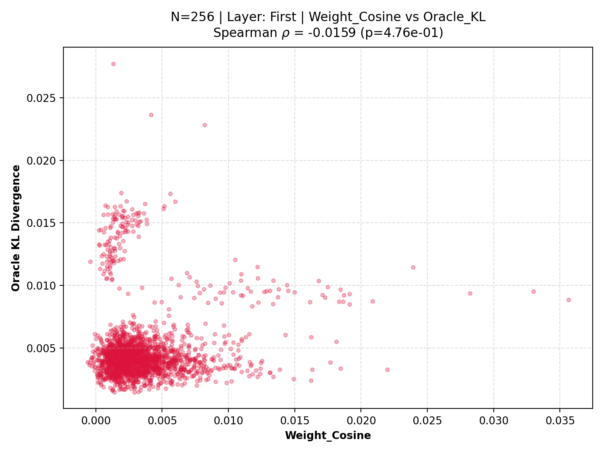
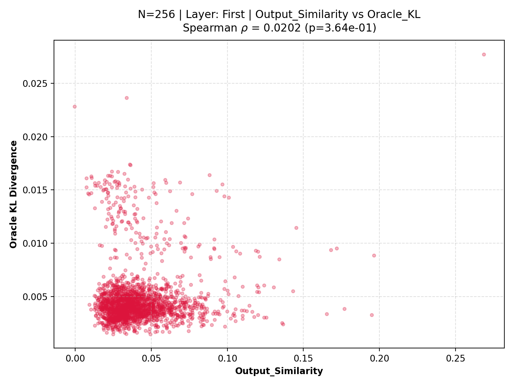
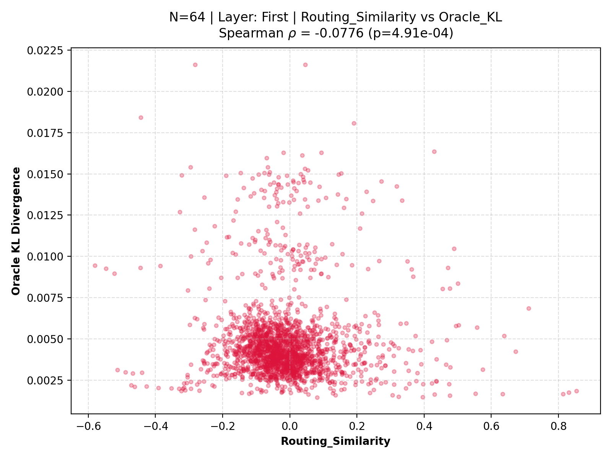
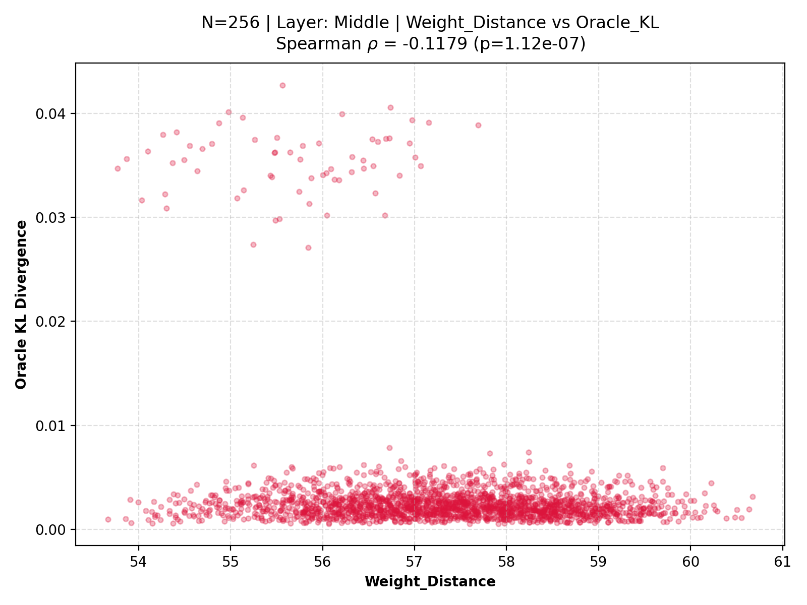
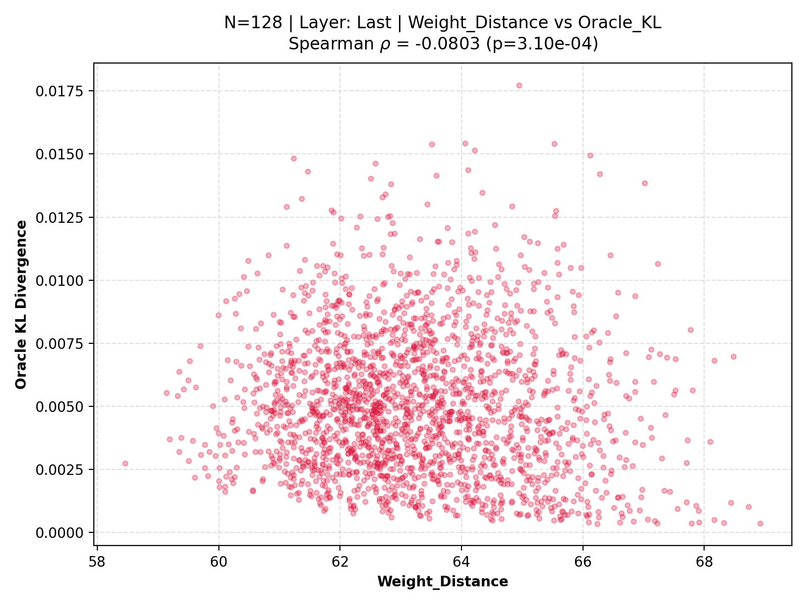
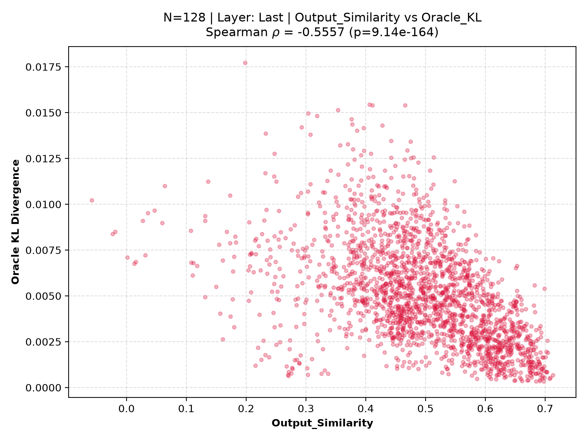

# Experiment 1: Understanding Individual Expert Similarity Metrics for Mergeability Prediction

---

# Abstract

The long-term objective of the Capability-Aware Redundancy Elimination (CARE) research program is to discover lightweight, explainable metrics that quantify expert capability, redundancy, and mergeability inside Mixture-of-Experts (MoE) language models without requiring expensive oracle evaluations. In this initial study (Experiment 1), we investigate whether the degradation incurred by merging two experts in OLMoE-1B-7B can be accurately predicted by any single handcrafted structural or functional similarity metric. Evaluating candidate descriptors across diverse calibration sizes ($N = 64, 128, 256$) and network depths (Early, Middle, Late layers), we demonstrate that no single metric reliably predicts ground-truth Oracle KL divergence. Most features exhibit absolute Spearman rank correlations $|\rho| < 0.2$, and scatter plots reveal diffuse, non-injective relationship clouds. We conclude that expert capability cannot be directly observed through any standalone heuristic, establishing that capability is an emergent latent property arising from multiple complementary, weak descriptors.

---

# 1. Objective

The first experiment investigates a fundamental question in Mixture-of-Experts (MoE) compression:

> **Can the mergeability of two experts be predicted using a single handcrafted similarity metric?**

If such a metric exists, expert merging could be performed without expensive oracle evaluation, enabling scalable model compression at zero inference overhead. This study evaluates whether commonly used expert similarity measures correlate with the actual operational degradation caused by merging two expert parameter sets.

---

# 2. Research Hypothesis

The initial hypothesis posited that structural or functional alignment directly implies capability preservation:

> **Hypothesis:** Experts that appear similar under a particular structural or functional metric should incur a smaller degradation after merging.

Formally, if $M(E_i, E_j)$ measures similarity between experts $E_i$ and $E_j$, then the mapping:
$$M(E_i, E_j) \longrightarrow \text{Oracle Merge Quality}$$
should exhibit a strong, robust monotonic relationship across layers and calibration distributions.

---

# 3. Experimental Setup

For every investigated pair of experts $(E_i, E_j)$ in OLMoE-1B-7B (16 MoE layers, 64 experts per layer), the following five-step evaluation protocol was executed:

1. **Step 1:** Collect calibration token activations from diverse textual sequences.
2. **Step 2:** Compute handcrafted similarity and distance metrics on original expert representations.
3. **Step 3:** Physically merge the experts $(E_i, E_j)$ (averaging parameter tensors).
4. **Step 4:** Execute a full evaluation forward pass through the merged model architecture.
5. **Step 5:** Measure **Oracle KL Divergence** ($D_{\text{KL}}(P_{\text{original}} \parallel P_{\text{merged}})$) over output logit distributions between the original uncompressed model and the newly merged model. Oracle KL is treated as the quantitative ground-truth merge cost.

---

# 4. Features Evaluated

We investigated seven handcrafted pre-merge expert descriptors covering parameter space, intermediate representations, and routing dynamics:

| Feature Name | Definition / Nature | Theoretical Intuition |
|---|---|---|
| **Weight Distance** | $\|\mathbf{w}_i - \mathbf{w}_j\|_2$ over flattened expert weights | Measures Euclidean parameter divergence; captures direct parameter redundancy. |
| **Weight Cosine** | $\frac{\mathbf{w}_i \cdot \mathbf{w}_j}{\|\mathbf{w}_i\| \|\mathbf{w}_j\|}$ over parameter vectors | Measures directional similarity; evaluates weight orientation independent of magnitude. |
| **Activation Similarity** | Cosine similarity of hidden activation profiles | Measures internal computation alignment on calibration data. |
| **Output Similarity** | Cosine similarity of final expert output vectors | Evaluates downstream functional equivalence across processed tokens. |
| **Routing Similarity** | Cosine similarity of router probability distributions | Evaluates whether the gating mechanism selects experts under similar contextual triggers. |
| **Usage Frequency** | Sum of top-1 token routing counts ($C_i + C_j$) | Acts as a coarse overall importance and utilization estimate. |
| **Jaccard Overlap** | $\frac{|S_i \cap S_j|}{|S_i \cup S_j|}$ over assigned token sets | Quantifies direct overlap in expert domain specialization. |

---

# 5. Experimental Conditions

To ensure empirical observations were robust and not idiosyncratic to specific network depths or data volumes, evaluations were systematically replicated across a comprehensive experimental matrix:

- **Calibration Token Budgets ($N$):** 
  - $N = 64$ sequences
  - $N = 128$ sequences
  - $N = 256$ sequences
  - $N = 512$ sequences *(ongoing scaling verification)*
- **Network Regions (Layer Depths):**
  - **Early Layer:** Layer index 0 (`first`)
  - **Middle Layer:** Layer index 8 (`middle`)
  - **Late Layer:** Layer index 15 (`last`, evaluated at $N \in \{64, 128\}$)

---

# 6. Evaluation Metric

The primary quantitative benchmark was **Spearman Rank Correlation ($\rho$)** computed between each individual feature and Oracle KL divergence.

**Why Rank Correlation?**
CARE is fundamentally formulating a *ranking problem*. When performing MoE layer reduction, an algorithm does not need to predict exact numerical KL divergence values; rather, it requires ordering candidate merge pairs from safest (lowest degradation) to riskiest (destructive degradation). Spearman's $\rho$ is strictly invariant to arbitrary monotonic transformations, capturing ranking preservation directly without distribution assumptions.

---

# 7. Experimental Results & Observations

The extensive computational grid across layers and calibration sample budgets yielded seven consistent empirical findings:

### Observation 1: No feature demonstrates strong predictive power
Across all calibration sizes ($N \in \{64, 128, 256\}$) and network depths, most handcrafted metrics exhibit absolute Spearman correlations $|\rho| < 0.2$, indicating extremely weak monotonic relationships. Even statistically significant correlations explain minimal practical variance in safe-vs-risky ranking.

### Observation 2: Performance depends strongly on network depth
The predictive utility of nearly every feature fluctuates dramatically across early, middle, and late network layers. For instance, weight geometry may correlate moderately in initial structural processing layers but degrade completely in deep semantic layers. No feature behaves consistently throughout the transformer backbone, proving that expert representations and functional roles evolve continuously with depth.

### Observation 3: Weight-based metrics perform better than activation metrics
**Weight Distance** and **Weight Cosine** demonstrate systematically stronger alignment with Oracle KL than dynamic activation or output measurements. However, even Weight Distance (peaking around $\rho \approx -0.57$ under optimal conditional slice filters) remains insufficient as a standalone threshold for reliable automated compression.

### Observation 4: Activation Similarity is essentially uninformative
Despite strong intuitive appeal, **Activation Similarity** consistently produces Spearman correlations proximate to zero ($\rho \approx -0.01$). Scatter distributions exhibit complete spatial overlapping between pristine, low-cost merges and catastrophically destructive merges, providing virtually zero ranking discriminant power.

### Observation 5: Output Similarity behaves similarly
While output vectors represent the explicit additive contribution of an expert to the residual stream, their empirical linear relationship with Oracle KL remains negligible. Experts generating highly analogous outputs on typical tokens can still induce severe capability collapse upon consolidation due to tail-case specialized weights.

### Observation 6: Routing behaviour alone is insufficient
**Routing Similarity** and **Jaccard Overlap** effectively profile gating specialization patterns; however, isolated routing statistics fail to predict merge quality. Highly co-routed experts frequently possess complementary, divergent internal transformations that destroy model capability when averaged.

### Observation 7: Usage Frequency contains weak but useful information
**Usage Frequency** occasionally demonstrates surprisingly consistent correlation positive gradients ($\rho \approx +0.41$). Heavily utilized "generalist" experts exhibit lower tolerance to merging than rarely triggered domain specialists. This critical behavioral observation served as primary motivation to incorporate utilization statistics inside multi-metric capability models.

---

# 8. Scatter Plot Analysis Across Calibration Sizes ($N$) & Network Depths

Qualitative evaluation of bivariate scatter distributions provides definitive empirical proof against individual heuristic predictors. Rather than forming condensed monotonic trajectories, individual metrics produce diffuse, isotropic point clouds.

## 8.1 Early Network Region (`first`, Layer 0)

In early layers, token routing is primarily structural. While weight-space features exhibit weak negative gradients, dynamic features show near-zero ranking separation.

### Weight Distance Scatter Profile ($N=256$, First Layer)

*Scientific Commentary:* Weight Distance demonstrates an approximate **triangular bounding contour**. While minimal weight distances rarely induce extreme KL drift, moderate-to-high distances span the entire vertical drift spectrum, preventing precise ranking thresholds.

### Weight Cosine Scatter Profile ($N=256$, First Layer)

*Scientific Commentary:* Displays **severe vertical variance** at high cosine alignments (>0.8). Parameter direction alignment does not guarantee functional safety upon weight averaging.

### Output Similarity Scatter Profile ($N=256$, First Layer)

*Scientific Commentary:* **Complete horizontal scattering** across similarity values with invariant vertical drift distribution. Output representation matching provides zero protection against destructive merges.

### Routing Similarity Profile ($N=64$, First Layer)

*Scientific Commentary:* Low sample estimation ($N=64$) confirms that routing similarity is fundamentally independent of parameter averaging tolerance; co-routed pairs show identical probability of severe degradation.

---

## 8.2 Middle Network Region (`middle`, Layer 8)

Middle layers handle deep abstract semantic transformations. Here, representation complexity deepens, causing simplistic similarity features to decouple further from Oracle KL.

### Weight Distance Scatter Profile ($N=256$, Middle Layer)

*Scientific Commentary:* Compared to early layers, the distribution widens significantly. Variance across the target Oracle KL axis explodes, illustrating layer-depth non-stationarity.

### Weight Cosine Scatter Profile ($N=128$, Middle Layer)

*Scientific Commentary:* Consistent non-injective structural pattern at moderate calibration sample budgets ($N=128$). Directional weight vectors remain insufficient predictors of semantic preservation.

---

## 8.3 Late Network Region (`last`, Layer 15)

In terminal layers ($N \in \{64, 128\}$), experts directly shape vocabulary logits and residual readout. Sensitivity to merging peaks, resulting in extreme outliers in Oracle KL that neither weights nor activations anticipate.

### Weight Distance Scatter Profile ($N=128$, Last Layer)

*Scientific Commentary:* Terminal layers exhibit discrete, high-drift outliers along the top vertical axis that appear entirely uncorrelated with weight L2 magnitude.

### Output Similarity Scatter Profile ($N=128$, Last Layer)

*Scientific Commentary:* High output similarity in final layers paradoxically co-occurs with massive Oracle KL spikes upon merging, likely due to cancellation of refined logit biases.

### Activation Similarity Scatter Profile ($N=64$, Last Layer)

*Scientific Commentary:* Persistent uninformative point cloud confirming null correlation across the entire network depth, even at low calibration budgets ($N=64$).

---

# 9. Interpretation & Non-Injective Mapping

The diffuse scatter distributions provide rigorous empirical evidence that the analytical mapping from any individual feature space to ground-truth merge degradation is **not injective**:

$$\text{Feature Value } x \not\implies \text{Unique KL Degradation } y$$

1. **Many-to-One / One-to-Many Deciding Failures:** Numerous distinct expert pairs sharing identical feature values exhibit variance spanning orders of magnitude in Oracle KL. Conversely, pairs generating virtually identical Oracle KL degradation occupy widely dispersed extremes of feature space.
2. **Multi-Factor Dependency:** Experiment 1 proves that expert mergeability is an emergent operational consequence governed by concurrent interactions between parameter geometry, routing frequency, internal computation complexity, and network position. No singular mathematical measurement can capture an expert's complete functional capability.

---

# 10. Scientific Insight: Capability as an Emergent Latent Property

This empirical conclusion represents the first major conceptual breakthrough of the CARE framework:

> **Scientific Insight:** Expert capability in Mixture-of-Experts architectures is not directly observable through localized structural or statistical heuristics. Instead, capability is a **latent property** that emerges through multiple complementary, weak descriptors.

This insight necessitates a fundamental reformulation of the compression problem. Rather than searching exhaustively for an elusive "optimal single similarity metric," intelligent MoE compression must transition toward **learning a robust representation of expert capability by synthesizing multiple weak, complementary observations.**

---

# 11. Limitations

- **Strict Univariate Focus:** Experiment 1 strictly evaluated features independently to isolate marginal predictive utility. It did not model non-additive interactions, feature multicollinearity, or multi-metric capability combinations.
- **Univariate Thresholding:** Because single features were examined in isolation, the study cannot rule out whether combinations of these seemingly uninformative signals yield highly accurate merge quality predictions when integrated jointly.

---

# 12. Conclusion

Experiment 1 decisively **rejects the original research hypothesis**: no single handcrafted similarity metric is capable of reliably predicting expert mergeability without running an expensive oracle evaluation.

However, analysis of cross-feature behavioral profiles demonstrates that individual features encode orthogonal, non-redundant aspects of expert dynamics (e.g., parameter geometry vs. gating behavior vs. usage volume). This directly motivates the guiding hypothesis for our follow-up investigation:

> **Transition Hypothesis:** Although individual expert descriptors are predictive failures in isolation, their joint multivariate representation may encode sufficient complementary information to model latent expert capability and predict merge degradation accurately.

---

# 13. Transition to Experiment 1.5

Experiment 1 marks the foundational transition from heuristic feature selection to principled capability modeling. By establishing that mergeability is an emergent operational consequence rather than a trivial geometric similarity, the study prompts our next critical research direction:

- **Experiment 1 Answered:** *Which feature is best?* $\longrightarrow$ **None; all individual features fail.**
- **Experiment 1.5 Asks:** *Can multiple weak expert descriptors collectively model expert capability, or does linear compression inherently suffer from a computational representational gap?*

This marks the initiation of CARE's multivariate predictive regression framework.
