# CARE – Experiment 1.5 Report Update

## Objective

Beyond evaluating predictive performance, Experiment 1.5 investigates which CARE proxy metrics contain unique predictive information, whether their relationships with Oracle KL are linear or non-linear, how they interact, where prediction failures occur, and whether the proxy space possesses an intrinsic structure that can guide the design of graph-based representations.

## Hypothesis

We hypothesize that:
1. Oracle KL cannot be explained by any single proxy.
2. Some proxy metrics are redundant.
3. Layer depth changes the importance of certain metrics.
4. A nonlinear combination of proxy metrics predicts merge quality significantly better than individual metrics.

## Results

### 1. Correlation Analysis

**Pearson correlations:**
- **Usage Frequency:** 0.33
- **Jaccard:** 0.08
- **Weight Distance:** -0.07
- **Routing:** -0.06
- **Output Similarity:** -0.05
- **Weight Cosine:** -0.03
- **Activation Similarity:** ≈0

**Interpretation**
Usage Frequency remains the strongest individual predictor. Activation Similarity again shows essentially no predictive relationship. This independently confirms Experiment 1.

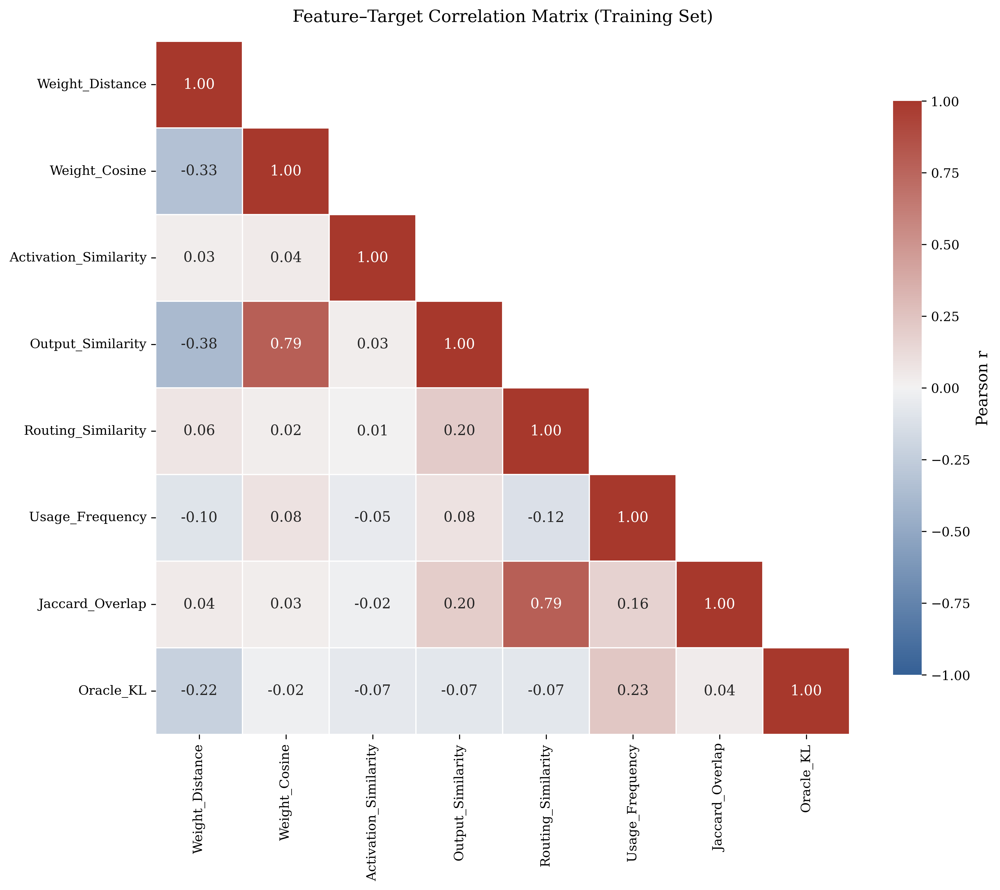

### 2. Discovery: Feature Redundancy

**Strong correlations between proxy metrics:**
- Weight Distance ↔ Output Similarity: r ≈ 0.82
- Routing Similarity ↔ Jaccard: r ≈ 0.80

**Interpretation**
CARE currently measures several metrics that encode almost identical information. Rather than seven independent signals, the proxy space appears to collapse into approximately four independent latent dimensions. This is the first evidence that the CARE metric space itself possesses internal structure.

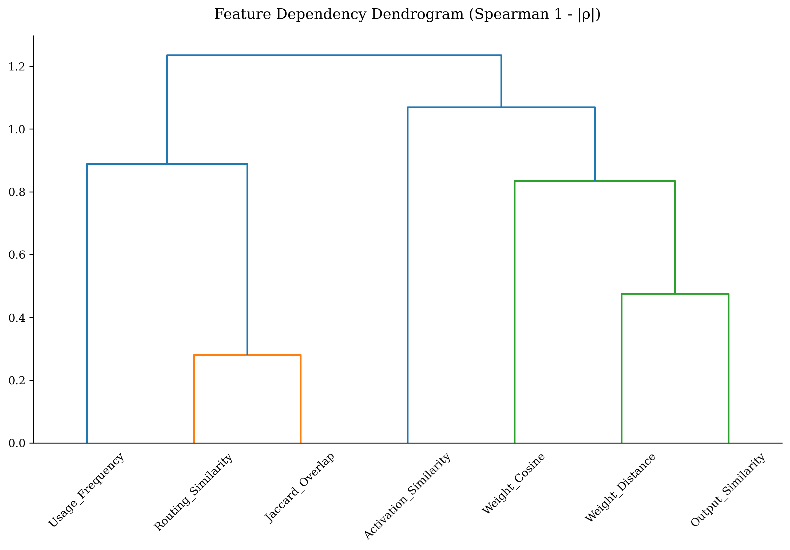

### 3. LASSO Regression

LASSO automatically removes redundant features.
- **Remaining features:** Usage Frequency, Jaccard Overlap, Routing Similarity, Weight Distance, Weight Cosine
- **Eliminated:** Activation Similarity, Output Similarity

**Interpretation**
Output Similarity is statistically redundant once Weight Distance is available. Activation Similarity contributes no independent predictive information. This provides statistical justification for simplifying CARE.

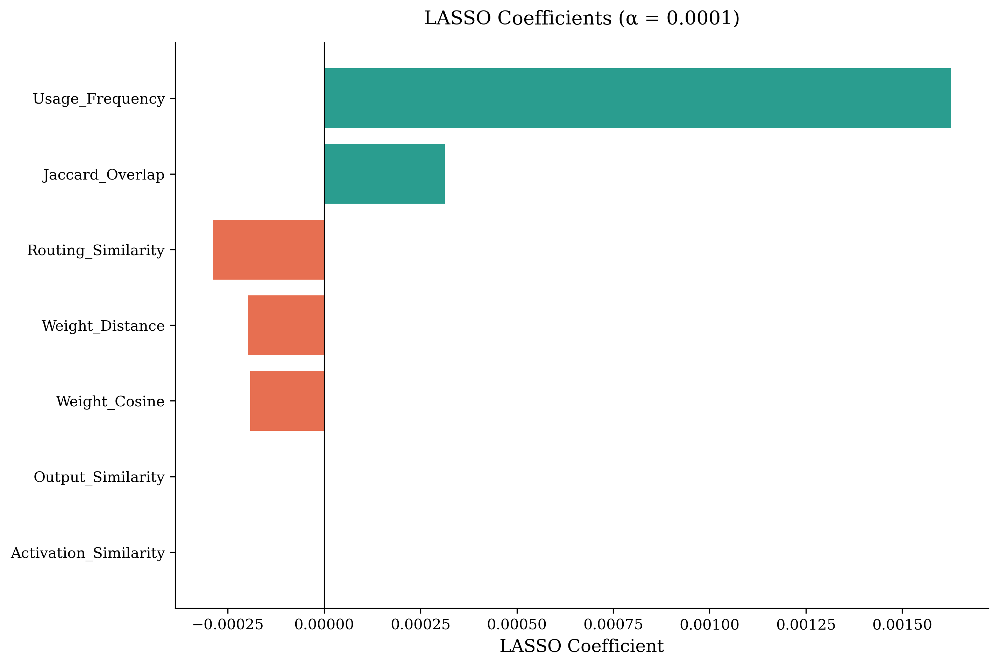

### 4. Feature Attribution Analysis

**Methods**
We performed four complementary analyses:
- Permutation Importance
- Partial Dependence (PDP)
- Individual Conditional Expectation (ICE)
- Pairwise PDP Interaction Heatmaps

XGBoost gain importance reflects training behaviour, whereas permutation importance measures the actual decrease in predictive performance after destroying feature information, providing a more reliable estimate of unique feature contribution.

**Results**
Permutation importance identifies Jaccard Overlap as the most indispensable predictor, followed by Usage Frequency, while interaction-aware features such as Jaccard × Depth also contribute substantially. 

This refines the conclusions drawn from SHAP and gain importance. Although Usage Frequency remains consistently important across attribution methods, permutation analysis indicates that routing overlap contains the largest amount of unique predictive information.

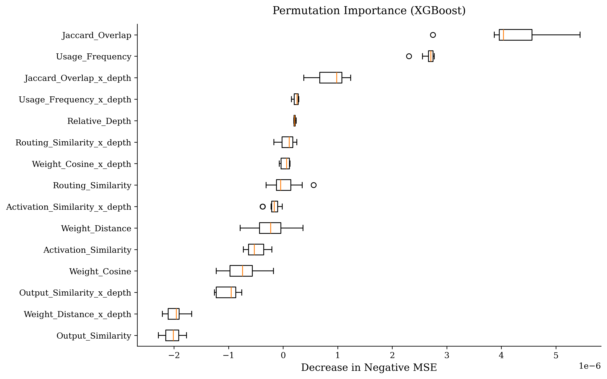
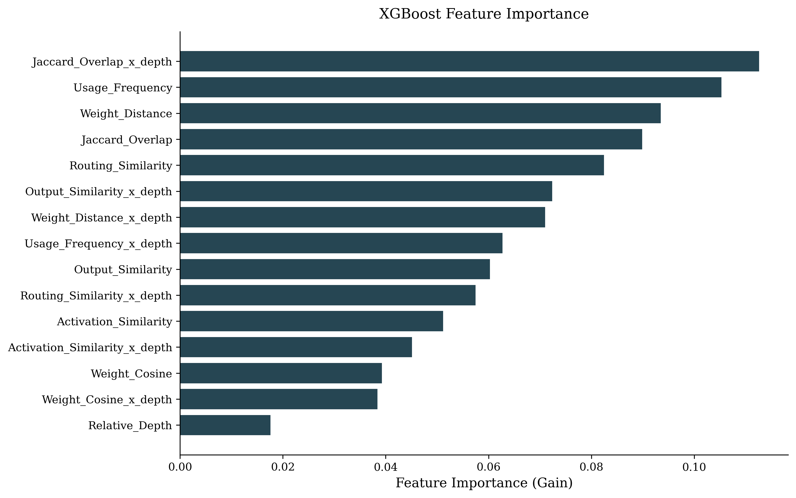

### 5. Non-linear Feature Behaviour

- **Usage Frequency:** Approximately monotonic increase, continuous relationship, no abrupt threshold.
  *Interpretation:* Frequently used experts progressively become harder to merge without increasing Oracle divergence.
- **Jaccard Overlap:** Rapid increase and saturation afterwards.
  *Interpretation:* Routing overlap exhibits diminishing returns. Beyond a moderate overlap threshold, additional routing similarity contributes little additional predictive information. This saturation effect is important.
- **Weight Distance:** Monotonic decrease, conditional effect.
  *Interpretation:* Since Weight Distance is correlated with Output Similarity, this relationship should be interpreted conditionally rather than causally.
- **Routing Similarity:** Threshold behaviour.

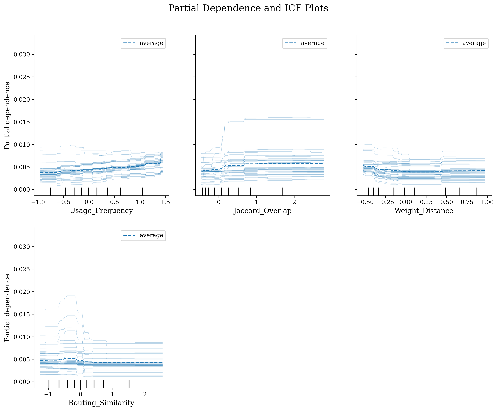

### 6. Feature Interaction Analysis

- **Usage × Jaccard:** Prediction increases most strongly only when both Usage Frequency and Routing Overlap are simultaneously high.
- **Usage × Weight Distance:** Expert importance depends jointly on dynamic usage and parameter geometry.
- **Routing × Jaccard:** Routing overlap alone is insufficient; the specific routing configuration also influences mergeability.

These observations demonstrate that CARE features interact rather than contribute independently, motivating interaction-aware modelling.

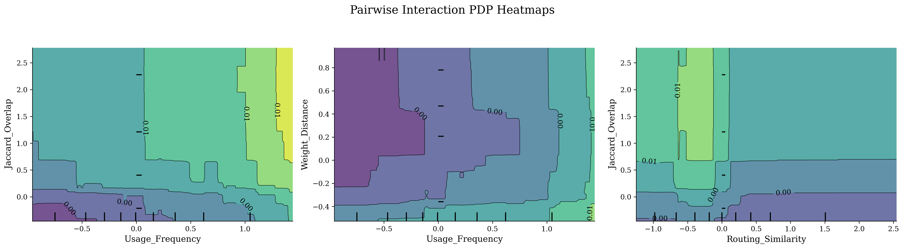

### 7. Failure Analysis

**Layer failures**
Prediction failures occur predominantly in middle transformer layers.
*Interpretation:* Middle layers exhibit richer expert dynamics than early or late layers.

**Oracle KL failures**
The largest prediction errors occur primarily for high Oracle-KL merges.
*Interpretation:* CARE accurately models safe merges but remains challenged by rare catastrophic merge cases.

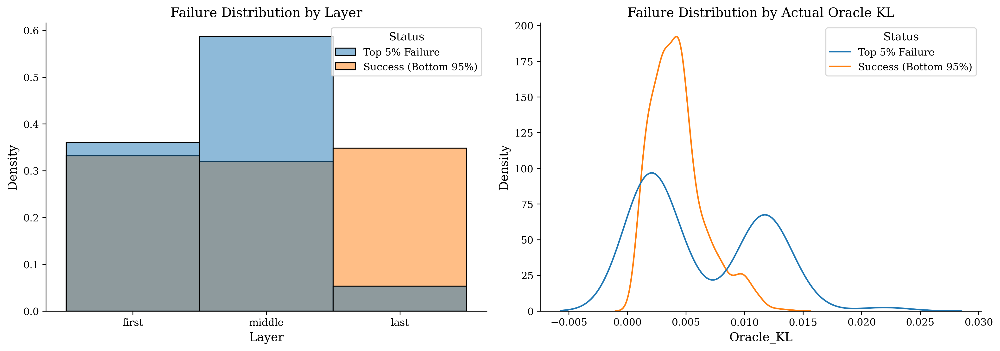

### 8. Intrinsic Structure of CARE Proxy Metrics

Hierarchical clustering reveals three naturally emerging feature families.

- **Structural:** Routing Similarity, Jaccard Overlap
  *Describes:* Captures expert routing behaviour.
- **Geometric:** Weight Distance, Weight Cosine, Output Similarity
  *Describes:* Captures parameter-space similarity.
- **Dynamic:** Usage Frequency
  *Describes:* Captures expert utilization.

Activation Similarity exhibits comparatively weak dependence with the remaining metrics.

Rather than representing unrelated heuristics, CARE metrics form structured groups corresponding to complementary aspects of expert behaviour.

### 9. Predictability of Oracle KL

**Best model:** XGBoost (Spearman ρ ≈ 0.65)

**Interpretation**
CARE proxy metrics explain a substantial fraction of Oracle KL ranking despite Oracle KL being highly nonlinear. This demonstrates that merge quality is predictable using proxy metrics alone.

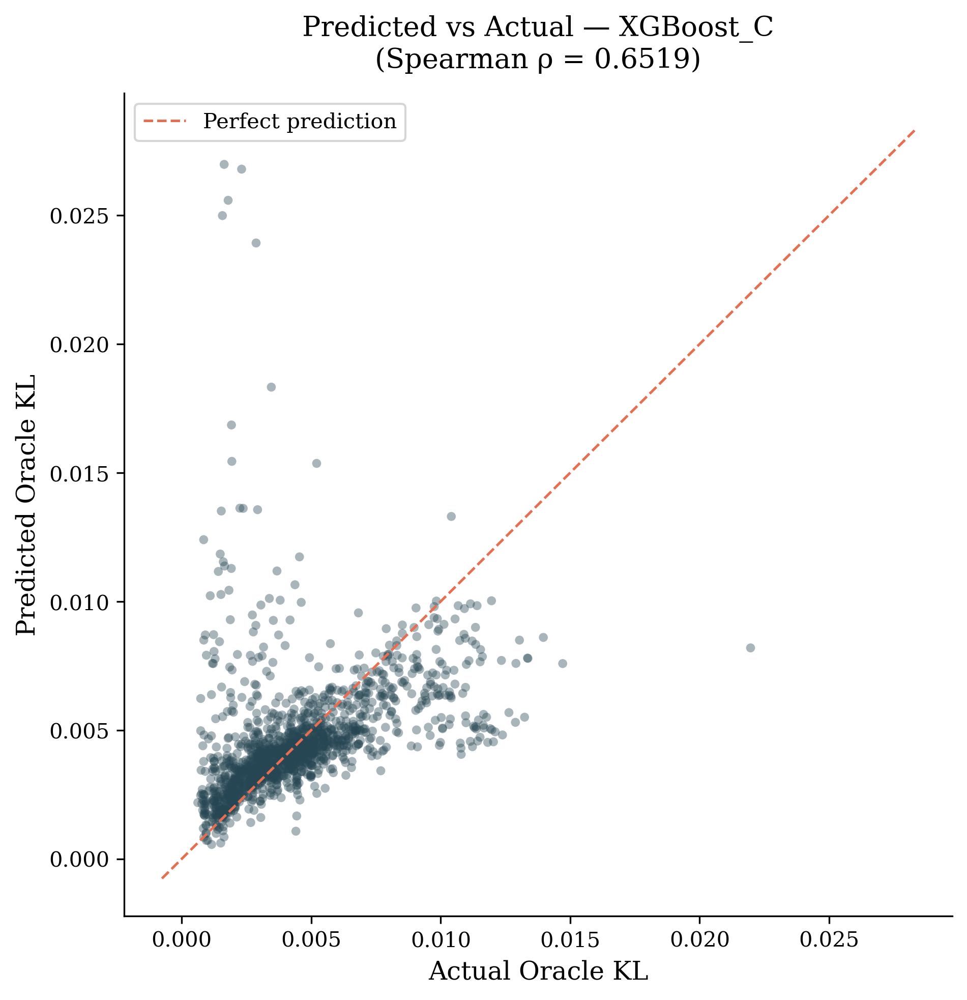

### 10. Residual Analysis

Residuals remain centered around zero for low Oracle KL values. For high predicted KL values the model tends to overestimate merge cost.

**Interpretation**
The predictor behaves conservatively. It is more accurate on low-loss merges than on catastrophic merges. For a merge recommendation framework this behavior is desirable because false-safe recommendations are minimized.

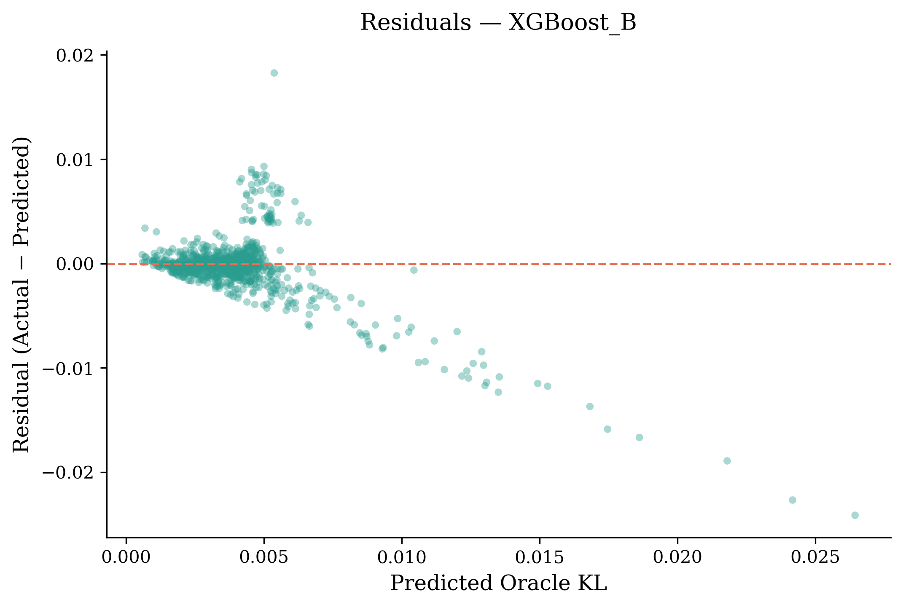

### 11. Linearization Gap

**Performance:**
- LASSO: ≈0.52
- Linear Regression: ≈0.55
- XGBoost: ≈0.65

**Interpretation**
Only about ~0.10 Spearman is gained by nonlinear modeling. Therefore, the relationship between proxy metrics and Oracle KL is predominantly linear with a modest nonlinear component. This is a stronger result than expected.

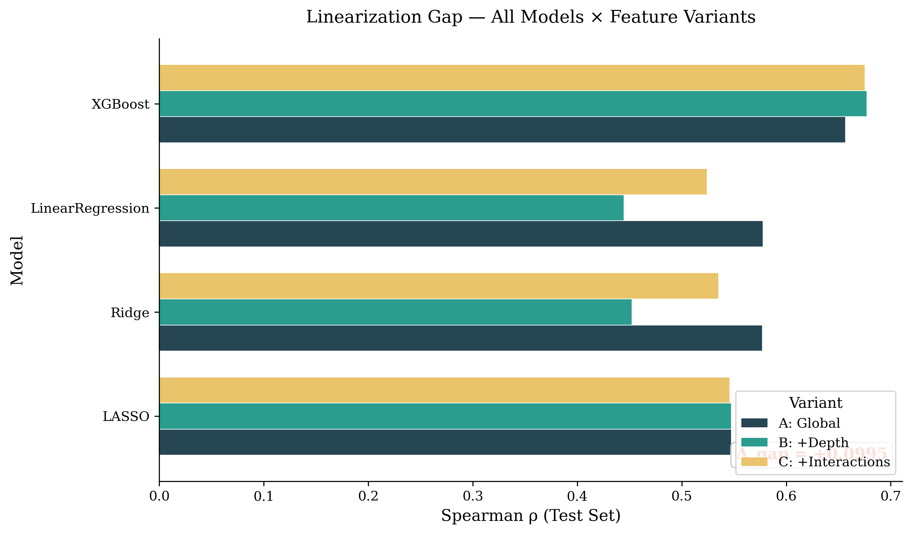

---

## New Scientific Findings

Experiment 1.5 produced several discoveries beyond Experiment 1.

**Finding 1:** CARE metrics are highly redundant. The proxy space naturally clusters into a smaller number of latent information sources.
**Finding 2:** Activation Similarity contributes negligible independent predictive information. It is consistently removed or ranked last across multiple statistical methods.
**Finding 3:** Depth modifies the meaning of routing overlap. Layer-aware interactions outperform global routing statistics.
**Finding 4:** Oracle KL is largely predictable using lightweight proxy metrics. This supports the feasibility of replacing expensive Oracle evaluation during merge candidate ranking.
**Finding 5:** Most predictive power is linear. Only a limited nonlinear correction is required.

## Discussion: Implications for CARE

Different attribution methods reveal complementary roles. Usage Frequency consistently exhibits high predictive influence, while permutation importance identifies Jaccard Overlap as the most indispensable source of unique predictive information. Together these findings suggest that mergeability depends jointly on structural routing information and expert utilization.

## Key Findings

- CARE metrics successfully predict Oracle KL.
- Routing overlap provides the strongest unique predictive signal.
- Usage Frequency provides complementary dynamic information.
- Feature interactions are essential.
- Relationships are highly non-linear.
- Prediction difficulty is concentrated in catastrophic merges and middle transformer layers.
- CARE metrics naturally organize into structural, geometric and dynamic information families.

## Changes Needed in CARE

These should now become explicit design choices.

**Keep:**
- Usage Frequency
- Weight Distance
- Routing Similarity
- Jaccard
- Weight Cosine

**Consider removing:**
- Activation Similarity
*Reason:* Repeatedly shown to contribute almost no predictive information.

**Consider merging:**
- Output Similarity into Weight Distance
*Reason:* Both encode nearly identical information.

**Add:**
- Layer-aware interaction terms.
Instead of `Jaccard`, use `Jaccard × Relative Depth`. Similarly for Weight Distance, Usage, and Routing.

## Direction for Experiment 3

Experiment 1 ↓ "What predicts Oracle KL?"
Experiment 1.5 ↓ "How do these predictors interact?"
Experiment 3 ↓ Can we build an explicit graph of expert relationships using these validated proxy metrics?

The emergence of three complementary information families suggests that representing experts using a single scalar similarity may discard meaningful relational information. Consequently, Experiment 3 models experts as a multiplex graph, where structural, geometric, and dynamic relationships are represented as distinct graph layers to preserve their complementary semantics.
