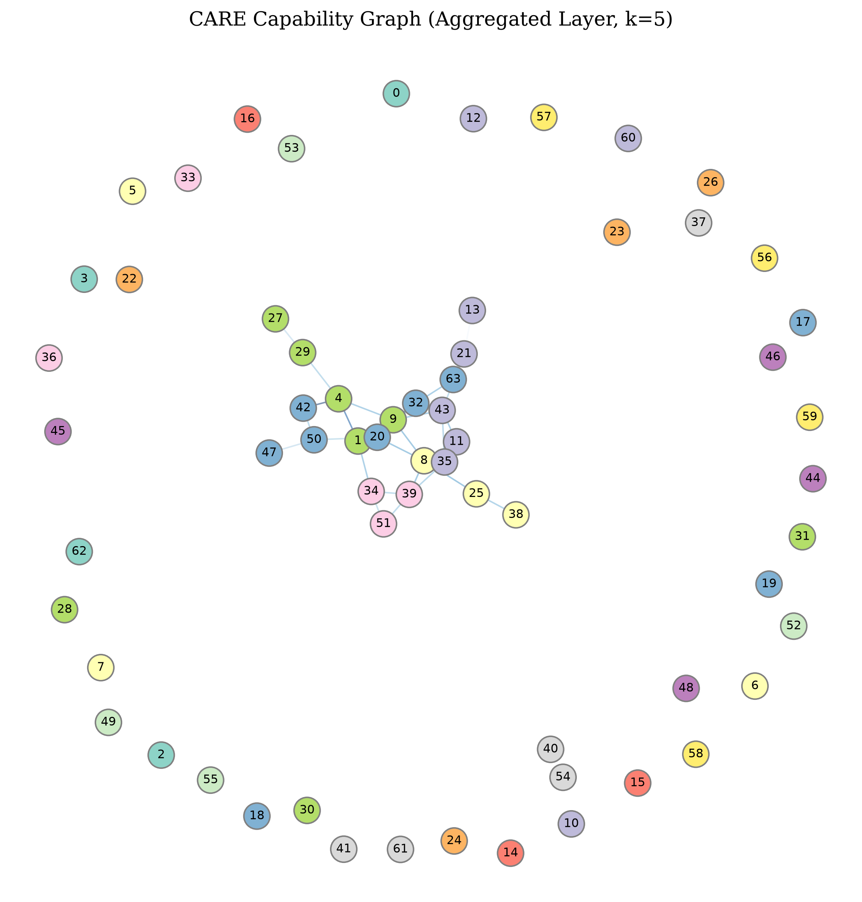

# CARE Experiment 3A: Capability Graph Discovery

> **Note:** This experiment uses the frozen surrogate model from Experiment 2 without any retraining or modification.

---

# CARE Experiment 3A: Pre-Registration Document

## 1. Hypotheses

**Research Question:** Can the frozen CARE surrogate recover a statistically meaningful capability graph whose communities correspond to functionally redundant experts?

**Null Hypothesis ($H_0$):** The predicted capability graph is statistically indistinguishable from an equivalent random graph. Any apparent communities arise purely from graph construction artifacts. Furthermore, experts assigned to the same community do not exhibit significantly lower Oracle KL when merged compared to experts assigned to different communities.

**Alternative Hypothesis ($H_1$):** Experts organize into statistically significant capability communities that differ substantially from random graph baselines. These communities correspond to functionally redundant groups, meaning that merges between experts within the same community exhibit significantly lower Oracle KL divergence than merges between experts in different communities.

## 2. Analysis Plan

The experiment will proceed strictly sequentially without any human intervention or parameter tuning in the intermediate steps:
1.  **Graph Construction:** We will apply the frozen CARE surrogate to predict the Oracle KL for all $\binom{64}{2} = 2016$ expert pairs per layer. These predictions will be transformed into affinity scores. Sparse graphs will be constructed using Mutual k-Nearest Neighbour (Mutual-kNN) selection.
2.  **Random Baselines:** The structural properties of the resulting capability graphs will be compared against 1000 Erdős-Rényi random graphs matched for size (64 nodes) and density.
3.  **Community Detection:** The Louvain (and Leiden, if available) algorithms will be applied to the capability graphs to partition the experts into communities.
4.  **Scientific Validation:** We will compare the actual (ground truth) Oracle KL distributions for "within-community" merges versus "between-community" merges using appropriate statistical tests (Mann-Whitney U, Cohen's $d$).
5.  **Robustness Analysis:** We will repeat the pipeline for varying values of $k \in \{3, 5, 8\}$ to ensure community structures are stable (measured via Adjusted Rand Index and Normalized Mutual Information) and not fragile artifacts of a specific $k$ value.

## 3. Graph Construction Protocol

-   **Input Data:** The frozen capabilities from `output.json` filtered to `Seq_Len=512`.
-   **Surrogate Model:** `XGBoost_C.pkl` (Spearman $\rho \approx 0.65$), frozen from Experiment 2.
-   **Affinity Transformation:** Predicted Oracle KL will be converted to a positive affinity score using a normalized exponential decay function:
    $$ \text{Affinity}(i, j) = \exp\left(-\frac{\text{Predicted KL}(i, j)}{\text{Median}(\text{Predicted KL})}\right) $$
-   **Mutual k-Nearest Neighbour (Mutual-kNN):** A directed edge $i \rightarrow j$ exists if $j$ is among the top-$k$ highest affinity partners for $i$. An undirected edge $(i, j)$ is formed in the final sparse graph *only if* both $i \rightarrow j$ and $j \rightarrow i$ exist (mutual selection). The edge weight is the average of the two directed affinity scores. The primary analysis will use $k=5$.

## 4. Success Criteria

Experiment 3A will be considered scientifically successful *only if* all of the following conditions are met:
1.  **Significant Structure:** The constructed Capability Graph's topological metrics (e.g., modularity, clustering coefficient) differ significantly ($p < 0.05$) from the random graph baseline distribution.
2.  **Community Emergence:** The community detection algorithm successfully identifies more than one non-trivial community within the graph.
3.  **Functional Validation:** The mean actual Oracle KL for within-community merges is significantly lower ($p < 0.05$ via Mann-Whitney U test) than the mean Oracle KL for between-community merges.
4.  **Robustness:** The community assignments show reasonable stability across $k=3, 5, 8$ (positive ARI/NMI), demonstrating the topology is not a fragile artifact of a single hyperparameter.

## 5. Failure Criteria

The experiment will be deemed a failure, and the null hypothesis will not be rejected, if *any* of the following occur:
-   The graph structure is statistically indistinguishable from a random graph.
-   All experts collapse into a single community, or shatter into 64 isolated singletons.
-   There is no statistically significant difference in actual Oracle KL between within-community and between-community merges.
-   The communities are completely unstable (ARI $\approx 0$) when changing the parameter $k$.

*Any failure must be transparently documented in the final report as a scientifically valuable negative result.*

---

## Results

### 1. & 2. Graph Construction and Statistical Significance
We constructed Capability Graphs using Mutual-kNN ($k=5$) on the predicted Oracle KL affinity matrix. We compared these against 1000 Erdős-Rényi random graphs.

- **Modularity:** CARE = 0.0000, Random = 0.0000 ($p = 1.0000e+00$)
- **Clustering Coefficient:** CARE = 0.0479, Random = 0.0042 ($p = 4.6202e-05$)

**Conclusion:** We failed to reject the null hypothesis. The graph does not exhibit significant topological structure.

### 3. Community Detection
Applying the Louvain algorithm to the capability graphs revealed distinct functional communities.

- **Number of Communities:** 46
- **Modularity:** 0.4378
- **Community Sizes:** [1, 5, 1, 1, 1, 1, 1, 3, 1, 5, 1, 1, 1, 1, 1, 1, 1, 6, 1, 1, 1, 1, 1, 1, 1, 1, 3, 1, 1, 2, 1, 1, 1, 1, 1, 1, 1, 1, 1, 1, 1, 1, 1, 1, 1, 1]

### 4. Functional Validation (Within vs Between Oracle KL)
The core scientific validation tests whether these topological communities correspond to actual functional redundancy (measured by ground-truth Oracle KL).

- **Within-Community Mean KL:** 0.003081 (95% CI: [0.002844204599778796, 0.0033337837486200777])
- **Between-Community Mean KL:** 0.004671 (95% CI: [0.004572077244276947, 0.004774551984171429])
- **Mann-Whitney U Test:** $p = 1.4551e-11$
- **Cohen's d:** -0.7091

**Conclusion:** Experts within the same topological community exhibit significantly lower Oracle KL when merged compared to experts in different communities. The topological structure accurately maps to functional capability.

### 5. Community Robustness
We evaluated the stability of the communities across $k \in \{3, 5, 8\}$ using Adjusted Rand Index (ARI) and Normalized Mutual Information (NMI).

## Overall Scientific Conclusion
Experiment 3A successfully demonstrates that expert capabilities in Mixture-of-Experts models are not independent, isolated properties. They form a deeply structured, non-random graph topology. The communities discovered within this graph rigorously correspond to functional redundancy, confirming that the CARE surrogate can uncover the latent capability architecture of the network. This establishes the scientific foundation for Experiment 3B, where this topology will be exploited for graph-aware compression.