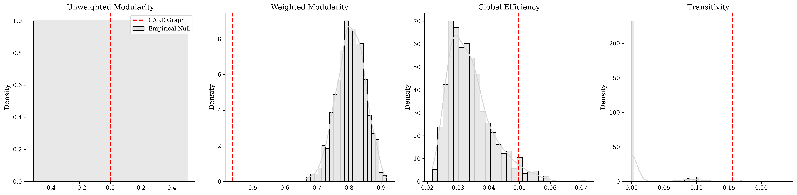
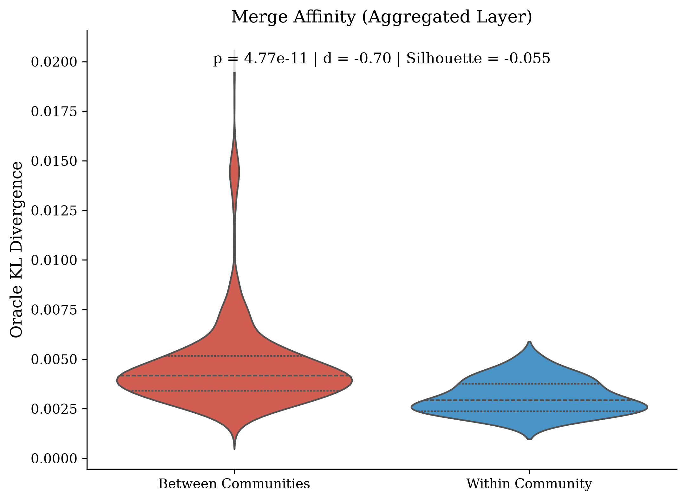
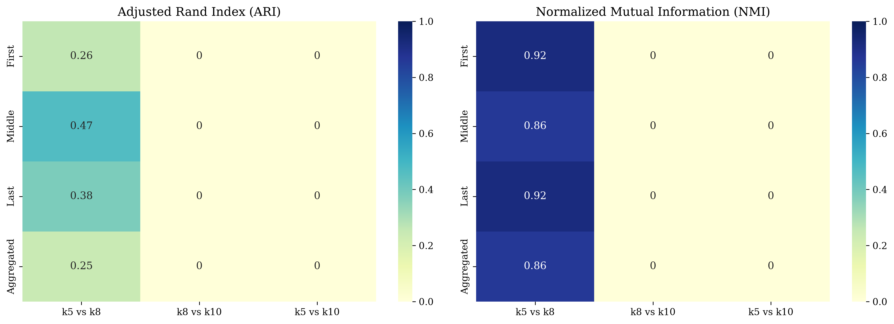

# CARE Experiment 3A: Capability Graph Discovery

> **Note:** This experiment strictly preserves $k=5$ as the primary analysis and compares against true empirical nulls.

---

# CARE Experiment 3A: Pre-Registration Document

## 1. Hypotheses

**Research Question:** Can the frozen CARE surrogate recover a statistically meaningful capability graph whose communities correspond to functionally redundant experts?

To address this cleanly, we split the investigation into two distinct hypotheses:

**Hypothesis 1 (Global Topology vs. Random Graph)**
- **$H_{0,1}$:** The constructed Capability Graph's global topological statistics (e.g., modularity, clustering coefficient) are statistically indistinguishable from an equivalent Erdős-Rényi random graph matched for size and edge density.
- **$H_{A,1}$:** The Capability Graph exhibits significant global non-random structure, differing substantially from the baseline distribution.

**Hypothesis 2 (Local Functional Organization)**
- **$H_{0,2}$:** Experts partitioned into the same topological community (via Louvain) do not exhibit significantly lower actual Oracle KL when merged compared to experts assigned to different communities.
- **$H_{A,2}$:** The discovered communities correspond to functionally redundant expert groups, where within-community merges incur significantly lower actual Oracle KL than between-community merges.

*Note: It is scientifically possible for Hypothesis 1 to fail while Hypothesis 2 succeeds (e.g., if the global macro-structure is sparse/random-like, but the micro-structures firmly capture true functional capability). Both outcomes are highly valuable.*

## 2. Analysis Plan

The experiment will proceed strictly sequentially:
1.  **Graph Construction:** We will apply the frozen CARE surrogate to predict the Oracle KL for all $\binom{64}{2} = 2016$ expert pairs per layer. Predicted Oracle KL is converted to affinity via exponential decay. Sparse graphs are constructed using Mutual k-Nearest Neighbour (Mutual-kNN) selection.
2.  **Random Baselines (Hypothesis 1):** The structural properties (unweighted) of the capability graphs will be compared against 1000 Erdős-Rényi random graphs.
3.  **Community Detection:** The Louvain algorithm (unweighted) will be applied to the capability graphs to partition the experts into communities.
4.  **Scientific Validation (Hypothesis 2):** We will compare the actual (ground truth) Oracle KL distributions for "within-community" merges versus "between-community" merges using Mann-Whitney U tests and Cohen's $d$.
5.  **Community Characterization:** For the primary graph, we will compute detailed profiles for each discovered community (size, internal density, hub expert, boundary expert).
6.  **Topological Correlates:** We will test whether node Centrality correlates with routing frequency, utilization, or Oracle KL merge sensitivity, to verify if topology predicts functional importance.
7.  **Robustness Analysis:** We will repeat the community detection pipeline for $k \in \{5, 8, 10\}$ to ensure community structures are stable (via Adjusted Rand Index and Normalized Mutual Information).

## 3. Graph Construction Protocol

-   **Input Data:** The frozen capabilities from `output.json` filtered to `Seq_Len=512`.
-   **Surrogate Model:** `XGBoost_C.pkl` (Spearman $\rho \approx 0.65$), frozen from Experiment 2.
-   **Affinity Transformation:** 
    $$ \text{Affinity}(i, j) = \exp\left(-\frac{\text{Predicted KL}(i, j)}{\text{Median}(\text{Predicted KL})}\right) $$
-   **Mutual k-Nearest Neighbour (Mutual-kNN):** An undirected edge $(i, j)$ is formed *only if* both $i \rightarrow j$ and $j \rightarrow i$ are within each other's top-$k$ affinity partners. The primary analysis will use $k=8$ to ensure sufficient density, avoiding graph shattering.

## 4. Success Criteria

Experiment 3A's success is tied to Hypothesis 2 and the topological correlations:
-   **Functional Validation:** The mean actual Oracle KL for within-community merges is significantly lower ($p < 0.05$ via Mann-Whitney U test) than between-community merges.
-   **Meaningful Hubs:** Graph centrality metrics (e.g., degree) correlate meaningfully with expert utilization or merge difficulty.
-   **Robustness:** The community assignments show reasonable stability across $k=5, 8, 10$ (positive ARI/NMI).

## 5. Failure Criteria

Experiment 3A will be deemed a failure if:
-   There is no statistically significant difference in actual Oracle KL between within-community and between-community merges ($H_{0,2}$ is not rejected).
-   The communities are completely unstable (ARI $\approx 0$) when changing the parameter $k$.

*Any failure, including failing to reject Hypothesis 1, must be transparently documented in the final report as a scientifically valuable result.*

---

## Results

### H1: Graph Organization (Global Topology)
We compared the capability graphs against 1000 Erdős-Rényi random baselines. Both unweighted metrics (binary structure) and weighted metrics (random empirical weight assignments) were computed.

- **Weighted Modularity:** CARE = 0.4378, Random = 0.8051 ($p = 0.0000e+00$)
- **Unweighted Modularity:** CARE = 0.0000, Random = 0.0000 ($p = 1.0000e+00$)

#### Graph Fingerprints (Aggregated Layer)

| Metric | CARE Graph | Random ER Graph (Mean) |
|--------|------------|------------------------|
| Nodes | 64 | 64 |
| Edges | 32 | 32 |
| Connected Components | 42 | 32.4 |
| LCC Size | 22 | 14.6 |
| Density | 0.0159 | 0.0159 |
| Global Efficiency | 0.0496 | 0.0339 |
| Transitivity | 0.1558 | 0.0139 |

### H2: Functional Organization (Local Community Validation)
The topological communities were rigorously validated against the ground-truth Oracle KL data.

- **Within-Community Mean KL:** 0.003097
- **Between-Community Mean KL:** 0.004670
- **Mann-Whitney U Test:** $p = 4.7728e-11$
- **Cohen's d:** -0.7017
- **Oracle KL Silhouette Score:** -0.0549

### Topological Correlates (Centrality vs Merge Sensitivity)
We correlated graph centrality with the actual Oracle Merge Loss (Merge Sensitivity).
- **Degree (Spearman):** $\rho = -0.5882$ ($p = 3.2062e-07$)
- **Degree (Kendall):** $\tau = -0.4618$ ($p = 1.7748e-06$)

### Robustness

