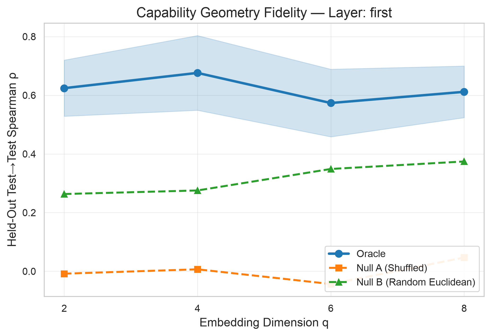
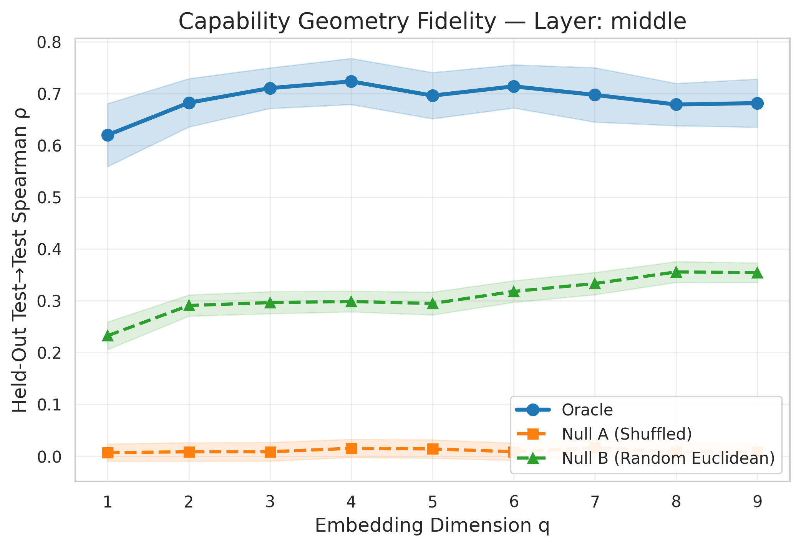
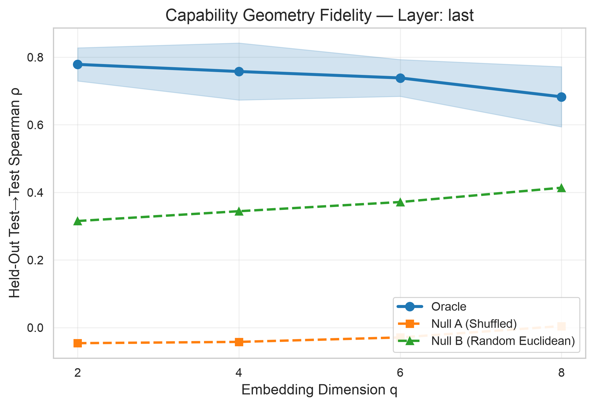
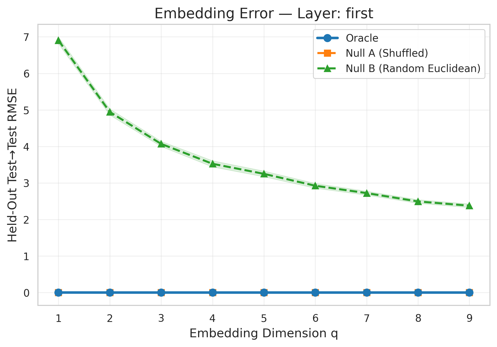
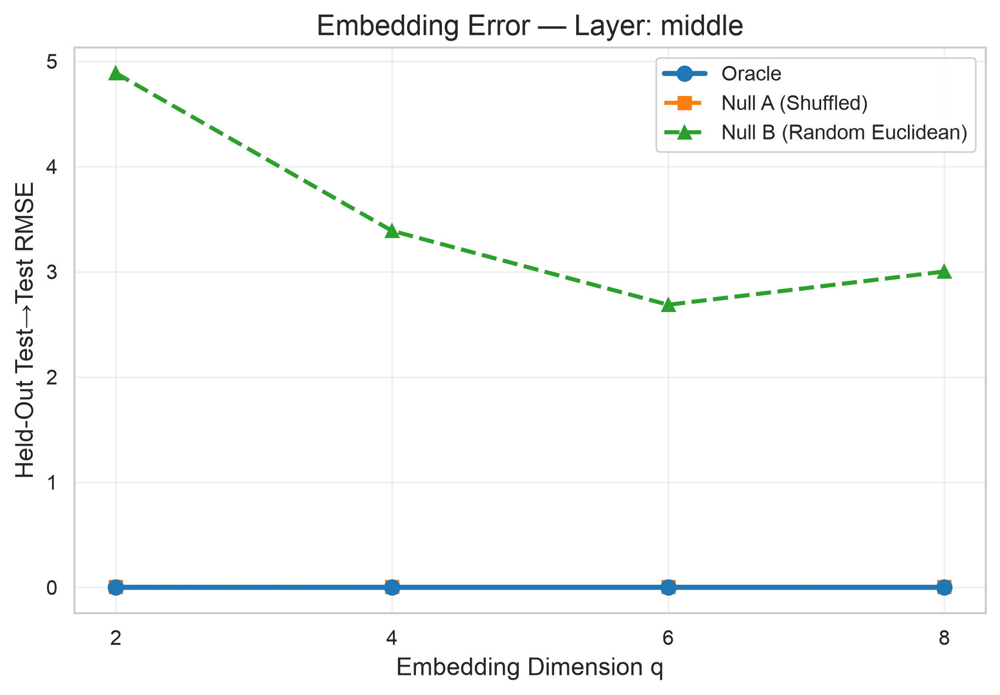
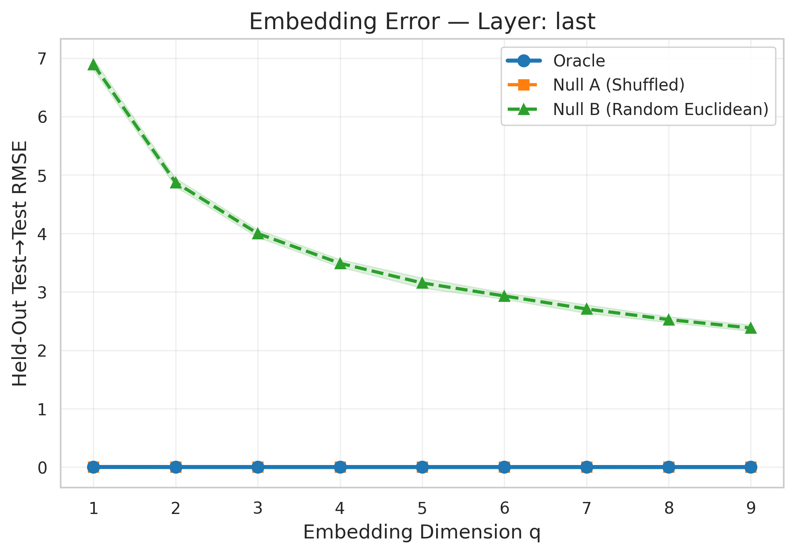

# Experiment 3B: Capability Geometry Validation — Phase A

## Final Report

---

## 1. Scientific Question

**Hypothesis**: "The functional behavior of MoE experts may possess a lower-dimensional geometric structure that generalizes to unseen experts."

Phase A tests whether the ground-truth functional distances among experts contain statistically meaningful low-dimensional structure that generalizes to held-out experts, compared to null models.

## 2. Data Provenance

- **Source**: `/Users/deepeshkumarjha/Desktop/CARE-MoE/Experiments-V3/results/exp1/output.json`
- **Ground truth**: Oracle_KL (KL divergence from original to merged-expert model)
- **Seq_Len filter**: 512
- **Experts**: 64
- **Layers**: first, middle, last
- **Pairs per layer**: C(64,2) = 2016
- **XGBoost surrogate**: EXCLUDED from geometry (used only in Exp 2/3A)
- **Raw distributions**: NOT available (only scalar Oracle_KL)

### Distance Construction

**Method**: d(i,j) = Oracle_KL(i,j)  [inherently symmetric]

**Justification**: Oracle_KL measures KL(P_original || P_merged) where the merged model is created by UniformAverage of experts i and j. Since merge(i,j) = merge(j,i), Oracle_KL is inherently symmetric. No symmetrization formula needed.

**Layer first**: min=0.001544, max=0.025590, mean=0.005062, median=0.004343, triangle violations=75
**Layer middle**: min=0.000579, max=0.043282, mean=0.003602, median=0.002374, triangle violations=1166
**Layer last**: min=0.000547, max=0.016362, mean=0.005248, median=0.004978, triangle violations=943

## 3. Methodology

### Embedding Method

- **Algorithm**: Non-metric MDS (SMACOF)
- **metric**: True (non-metric)
- **max_iter**: 3000
- **n_init**: 4
- **eps**: 0.0001
- **Dimensions tested**: q ∈ {1, 2, 3, 4, 5, 6, 7, 8, 9}

### Cross-Validation

- **Expert-level holdout**: 5-fold × 10 repetitions = 50 total folds
- **Training experts**: ~52 per fold
- **Held-out experts**: ~12 per fold
- **Out-of-sample embedding**: Coordinate optimization with frozen Z_train
  - Method: L-BFGS-B
  - Restarts: 5
  - Objective: argmin_z Σ_i (||z - z_i||₂ - d_ji)²

### Null Models

- **Null A (Pairwise-Shuffled)**: 30 realizations
  - Upper-triangle distances randomly permuted
  - Preserves marginal distance distribution, destroys expert-identity structure
- **Null B (Random Euclidean)**: 30 realizations
  - 64 random points in R^64
  - Independent generic high-dimensional geometry baseline

## 4. Results

### Layer: first

| q | Oracle ρ | Null A ρ | Null B ρ | Oracle RMSE | Null A RMSE | Null B RMSE | Oracle Stress | Null A Stress | Null B Stress |
|---|---------|---------|---------|-------------|-------------|-------------|---------------|---------------|---------------|
| 1 | 0.4759 [0.4039, 0.5479] | 0.0046 [-0.0140, 0.0231] | 0.2009 [0.1742, 0.2276] | 0.0026 [0.0025, 0.0028] | 0.0042 [0.0042, 0.0043] | 6.9042 [6.8138, 6.9945] | 0.4843 [0.4543, 0.5143] | 0.7234 [0.7162, 0.7306] | 0.6079 [0.6007, 0.6151] |
| 2 | 0.6042 [0.5524, 0.6560] | 0.0083 [-0.0114, 0.0279] | 0.2898 [0.2708, 0.3088] | 0.0020 [0.0018, 0.0021] | 0.0036 [0.0035, 0.0037] | 4.9445 [4.8624, 5.0265] | 0.3613 [0.3410, 0.3816] | 0.6153 [0.6089, 0.6218] | 0.4358 [0.4285, 0.4431] |
| 3 | 0.6301 [0.5769, 0.6832] | -0.0016 [-0.0208, 0.0177] | 0.3220 [0.3001, 0.3439] | 0.0017 [0.0016, 0.0019] | 0.0034 [0.0033, 0.0035] | 4.0702 [4.0008, 4.1397] | 0.3236 [0.3031, 0.3442] | 0.5783 [0.5715, 0.5851] | 0.3586 [0.3531, 0.3641] |
| 4 | 0.6257 [0.5781, 0.6733] | -0.0039 [-0.0250, 0.0172] | 0.3234 [0.3028, 0.3440] | 0.0017 [0.0016, 0.0018] | 0.0033 [0.0032, 0.0033] | 3.5258 [3.4430, 3.6085] | 0.3177 [0.2963, 0.3390] | 0.5564 [0.5502, 0.5627] | 0.3108 [0.3032, 0.3184] |
| 5 | 0.5764 [0.5228, 0.6300] | 0.0191 [0.0009, 0.0373] | 0.3122 [0.2935, 0.3309] | 0.0018 [0.0017, 0.0019] | 0.0032 [0.0031, 0.0032] | 3.2506 [3.1738, 3.3273] | 0.3287 [0.3079, 0.3495] | 0.5399 [0.5338, 0.5460] | 0.2865 [0.2798, 0.2931] |
| 6 | 0.5502 [0.4858, 0.6146] | 0.0086 [-0.0127, 0.0300] | 0.3477 [0.3280, 0.3674] | 0.0017 [0.0016, 0.0018] | 0.0031 [0.0031, 0.0032] | 2.9248 [2.8609, 2.9888] | 0.3201 [0.2980, 0.3422] | 0.5321 [0.5264, 0.5378] | 0.2579 [0.2523, 0.2634] |
| 7 | 0.5770 [0.5204, 0.6336] | 0.0155 [-0.0007, 0.0317] | 0.3541 [0.3379, 0.3703] | 0.0017 [0.0016, 0.0019] | 0.0031 [0.0030, 0.0031] | 2.7232 [2.6712, 2.7752] | 0.3216 [0.2992, 0.3440] | 0.5252 [0.5194, 0.5311] | 0.2400 [0.2355, 0.2445] |
| 8 | 0.5608 [0.4991, 0.6226] | -0.0006 [-0.0199, 0.0187] | 0.3551 [0.3356, 0.3747] | 0.0017 [0.0016, 0.0018] | 0.0031 [0.0030, 0.0031] | 2.4952 [2.4475, 2.5429] | 0.3230 [0.2989, 0.3472] | 0.5230 [0.5173, 0.5287] | 0.2200 [0.2158, 0.2242] |
| 9 | 0.5371 [0.4831, 0.5912] | 0.0071 [-0.0124, 0.0265] | 0.3937 [0.3713, 0.4162] | 0.0018 [0.0017, 0.0019] | 0.0030 [0.0030, 0.0031] | 2.3791 [2.3302, 2.4279] | 0.3365 [0.3134, 0.3596] | 0.5168 [0.5117, 0.5219] | 0.2097 [0.2051, 0.2142] |

### Layer: middle

| q | Oracle ρ | Null A ρ | Null B ρ | Oracle RMSE | Null A RMSE | Null B RMSE | Oracle Stress | Null A Stress | Null B Stress |
|---|---------|---------|---------|-------------|-------------|-------------|---------------|---------------|---------------|
| 1 | 0.6198 [0.5591, 0.6805] | 0.0070 [-0.0096, 0.0237] | 0.2325 [0.2059, 0.2591] | 0.0014 [0.0013, 0.0015] | 0.0060 [0.0058, 0.0063] | 6.8797 [6.8120, 6.9473] | 0.4014 [0.3603, 0.4425] | 0.9216 [0.9133, 0.9299] | 0.6089 [0.6031, 0.6146] |
| 2 | 0.6821 [0.6355, 0.7287] | 0.0085 [-0.0094, 0.0263] | 0.2908 [0.2704, 0.3113] | 0.0012 [0.0011, 0.0013] | 0.0059 [0.0056, 0.0061] | 4.8460 [4.7871, 4.9050] | 0.3328 [0.2987, 0.3669] | 0.8835 [0.8757, 0.8913] | 0.4291 [0.4244, 0.4338] |
| 3 | 0.7103 [0.6711, 0.7495] | 0.0086 [-0.0094, 0.0267] | 0.2964 [0.2752, 0.3177] | 0.0011 [0.0010, 0.0012] | 0.0058 [0.0056, 0.0060] | 4.0863 [3.9949, 4.1776] | 0.2979 [0.2683, 0.3275] | 0.8738 [0.8661, 0.8815] | 0.3619 [0.3542, 0.3695] |
| 4 | 0.7233 [0.6789, 0.7677] | 0.0152 [-0.0024, 0.0328] | 0.2985 [0.2785, 0.3185] | 0.0011 [0.0010, 0.0012] | 0.0058 [0.0055, 0.0060] | 3.6112 [3.5329, 3.6895] | 0.2877 [0.2589, 0.3166] | 0.8675 [0.8596, 0.8754] | 0.3198 [0.3128, 0.3269] |
| 5 | 0.6959 [0.6512, 0.7405] | 0.0140 [-0.0038, 0.0318] | 0.2947 [0.2727, 0.3167] | 0.0011 [0.0010, 0.0012] | 0.0057 [0.0055, 0.0060] | 3.1874 [3.1220, 3.2528] | 0.2958 [0.2680, 0.3236] | 0.8640 [0.8555, 0.8724] | 0.2824 [0.2766, 0.2882] |
| 6 | 0.7137 [0.6721, 0.7553] | 0.0087 [-0.0081, 0.0255] | 0.3179 [0.2971, 0.3388] | 0.0011 [0.0009, 0.0012] | 0.0057 [0.0055, 0.0060] | 2.9545 [2.8980, 3.0111] | 0.2874 [0.2595, 0.3154] | 0.8617 [0.8533, 0.8701] | 0.2617 [0.2568, 0.2666] |
| 7 | 0.6973 [0.6449, 0.7497] | 0.0162 [-0.0002, 0.0325] | 0.3332 [0.3117, 0.3548] | 0.0011 [0.0009, 0.0012] | 0.0057 [0.0055, 0.0060] | 2.7019 [2.6303, 2.7734] | 0.2877 [0.2588, 0.3166] | 0.8592 [0.8507, 0.8677] | 0.2395 [0.2332, 0.2457] |
| 8 | 0.6787 [0.6379, 0.7194] | 0.0084 [-0.0086, 0.0253] | 0.3556 [0.3355, 0.3756] | 0.0011 [0.0010, 0.0012] | 0.0057 [0.0055, 0.0060] | 2.4934 [2.4448, 2.5419] | 0.3008 [0.2728, 0.3289] | 0.8593 [0.8508, 0.8678] | 0.2208 [0.2166, 0.2251] |
| 9 | 0.6814 [0.6350, 0.7278] | 0.0080 [-0.0080, 0.0240] | 0.3543 [0.3354, 0.3732] | 0.0011 [0.0010, 0.0012] | 0.0057 [0.0055, 0.0060] | 2.3799 [2.3230, 2.4368] | 0.3024 [0.2728, 0.3320] | 0.8590 [0.8508, 0.8672] | 0.2108 [0.2059, 0.2158] |

### Layer: last

| q | Oracle ρ | Null A ρ | Null B ρ | Oracle RMSE | Null A RMSE | Null B RMSE | Oracle Stress | Null A Stress | Null B Stress |
|---|---------|---------|---------|-------------|-------------|-------------|---------------|---------------|---------------|
| 1 | 0.5629 [0.4969, 0.6288] | -0.0106 [-0.0293, 0.0081] | 0.2025 [0.1821, 0.2229] | 0.0030 [0.0027, 0.0032] | 0.0042 [0.0041, 0.0042] | 6.8918 [6.8008, 6.9829] | 0.5097 [0.4893, 0.5300] | 0.7135 [0.7044, 0.7227] | 0.6077 [0.6004, 0.6150] |
| 2 | 0.6771 [0.6260, 0.7281] | 0.0071 [-0.0155, 0.0297] | 0.3081 [0.2879, 0.3282] | 0.0023 [0.0021, 0.0024] | 0.0035 [0.0035, 0.0036] | 4.8718 [4.7989, 4.9447] | 0.3867 [0.3690, 0.4044] | 0.6005 [0.5920, 0.6090] | 0.4299 [0.4236, 0.4362] |
| 3 | 0.7077 [0.6569, 0.7585] | -0.0005 [-0.0209, 0.0198] | 0.3134 [0.2958, 0.3310] | 0.0021 [0.0019, 0.0023] | 0.0032 [0.0032, 0.0033] | 3.9988 [3.9346, 4.0630] | 0.3530 [0.3300, 0.3759] | 0.5532 [0.5471, 0.5592] | 0.3529 [0.3475, 0.3584] |
| 4 | 0.7105 [0.6545, 0.7664] | -0.0020 [-0.0245, 0.0206] | 0.3070 [0.2848, 0.3293] | 0.0020 [0.0018, 0.0022] | 0.0031 [0.0030, 0.0031] | 3.4897 [3.4250, 3.5544] | 0.3350 [0.3130, 0.3570] | 0.5294 [0.5230, 0.5359] | 0.3079 [0.3026, 0.3133] |
| 5 | 0.7006 [0.6430, 0.7582] | 0.0000 [-0.0266, 0.0267] | 0.3324 [0.3148, 0.3500] | 0.0020 [0.0018, 0.0021] | 0.0030 [0.0030, 0.0030] | 3.1531 [3.0679, 3.2383] | 0.3333 [0.3105, 0.3562] | 0.5127 [0.5064, 0.5190] | 0.2783 [0.2709, 0.2856] |
| 6 | 0.7203 [0.6770, 0.7636] | 0.0037 [-0.0206, 0.0280] | 0.3558 [0.3383, 0.3734] | 0.0019 [0.0018, 0.0021] | 0.0029 [0.0029, 0.0030] | 2.9303 [2.8754, 2.9851] | 0.3304 [0.3115, 0.3492] | 0.5038 [0.4971, 0.5105] | 0.2586 [0.2542, 0.2630] |
| 7 | 0.6946 [0.6403, 0.7490] | -0.0005 [-0.0243, 0.0234] | 0.3654 [0.3399, 0.3910] | 0.0020 [0.0018, 0.0021] | 0.0029 [0.0029, 0.0029] | 2.7073 [2.6362, 2.7784] | 0.3301 [0.3085, 0.3517] | 0.4960 [0.4896, 0.5024] | 0.2390 [0.2327, 0.2452] |
| 8 | 0.7301 [0.6824, 0.7778] | 0.0095 [-0.0166, 0.0356] | 0.3546 [0.3370, 0.3721] | 0.0018 [0.0016, 0.0020] | 0.0029 [0.0028, 0.0029] | 2.5264 [2.4761, 2.5767] | 0.3075 [0.2876, 0.3273] | 0.4886 [0.4827, 0.4946] | 0.2230 [0.2185, 0.2276] |
| 9 | 0.7386 [0.6854, 0.7918] | -0.0011 [-0.0243, 0.0222] | 0.3772 [0.3605, 0.3939] | 0.0018 [0.0016, 0.0020] | 0.0028 [0.0028, 0.0029] | 2.3817 [2.3286, 2.4349] | 0.3080 [0.2877, 0.3284] | 0.4871 [0.4812, 0.4929] | 0.2102 [0.2056, 0.2148] |

## 5. Statistical Comparisons

| Layer | q | Δρ(Oracle−NullA) | CI excl 0? | Δρ(Oracle−NullB) | CI excl 0? |
|-------|---|------------------|------------|------------------|------------|
| first | 1 | +0.4714 | Yes | +0.2751 | Yes |
| first | 2 | +0.5960 | Yes | +0.3144 | Yes |
| first | 3 | +0.6316 | Yes | +0.3080 | Yes |
| first | 4 | +0.6296 | Yes | +0.3023 | Yes |
| first | 5 | +0.5573 | Yes | +0.2642 | Yes |
| first | 6 | +0.5416 | Yes | +0.2025 | Yes |
| first | 7 | +0.5615 | Yes | +0.2229 | Yes |
| first | 8 | +0.5614 | Yes | +0.2057 | Yes |
| first | 9 | +0.5301 | Yes | +0.1434 | Yes |
| middle | 1 | +0.6128 | Yes | +0.3873 | Yes |
| middle | 2 | +0.6737 | Yes | +0.3913 | Yes |
| middle | 3 | +0.7017 | Yes | +0.4139 | Yes |
| middle | 4 | +0.7081 | Yes | +0.4248 | Yes |
| middle | 5 | +0.6819 | Yes | +0.4011 | Yes |
| middle | 6 | +0.7050 | Yes | +0.3958 | Yes |
| middle | 7 | +0.6812 | Yes | +0.3641 | Yes |
| middle | 8 | +0.6703 | Yes | +0.3231 | Yes |
| middle | 9 | +0.6734 | Yes | +0.3272 | Yes |
| last | 1 | +0.5735 | Yes | +0.3604 | Yes |
| last | 2 | +0.6699 | Yes | +0.3690 | Yes |
| last | 3 | +0.7082 | Yes | +0.3943 | Yes |
| last | 4 | +0.7124 | Yes | +0.4034 | Yes |
| last | 5 | +0.7005 | Yes | +0.3682 | Yes |
| last | 6 | +0.7166 | Yes | +0.3645 | Yes |
| last | 7 | +0.6951 | Yes | +0.3292 | Yes |
| last | 8 | +0.7206 | Yes | +0.3755 | Yes |
| last | 9 | +0.7397 | Yes | +0.3614 | Yes |

## 6. Figures

### Primary Figure 1: Fidelity Curve (Test→Test Spearman ρ)

### Primary Figure 2: Stress Curve (Test→Test RMSE)

## 7. Data Leakage Audit

| Check | Status | Detail |
|-------|--------|--------|
| Ground-truth Oracle data used | ✅ **PASS** | Ground truth field: Oracle_KL, Source: /home/sandlogic/LINGO/PROJECTS/Experiments-V3/results/exp1/ou |
| XGBoost predictions excluded from geometry | ✅ **PASS** | XGBoost Predicted_KL from Experiment 2 is an approximation of Oracle KL. Using it as ground truth wo |
| Test experts excluded from Z_train fitting | ✅ **PASS** | run_smacof_train receives D_train (train×train submatrix only). Test expert indices are never includ |
| Z_train frozen during test embedding | ✅ **PASS** | embed_single_test_expert takes z_train as read-only input. Only the test coordinate z_j is optimized |
| Test-test distances excluded from test embedding | ✅ **PASS** | embed_single_test_expert receives only d_test_to_train (distances to training experts). Test-test di |
| q selected without using test performance | ✅ **PASS** | All q values are evaluated and reported. No single q is selected as 'optimal' using test performance |
| Oracle and null processed identically | ✅ **PASS** | run_cv_for_matrix is called identically for Oracle, Null A, and Null B. Same fold splits (matched se |

**Overall**: ALL PASS — EXPERIMENT VALID

## 8. Scientific Classification

### Classification: **A. STRONG SUPPORT**

Oracle functional geometry shows substantially stronger low-dimensional held-out fidelity than both null models. The evidence supports the existence of a meaningful low-dimensional geometric structure in expert functional relationships.

### Evidence Summary

- Total (layer, q) comparisons: 27
- Significant vs Null A: 27 (100.0%)
- Significant vs Null B: 27 (100.0%)
- Mean Oracle ρ: 0.6512
- Mean Null A ρ: 0.0058
- Mean Null B ρ: 0.3181
- Mean advantage vs Null A: +0.6454
- Mean advantage vs Null B: +0.3331

## 9. Post-Experiment Analysis & Next Steps

### The Dimensionality Discovery
The geometry's effective dimensionality is fundamentally **layer-dependent**: 
the first layer peaks in out-of-sample fidelity at $q=3-4$, whereas the last layer requires $q=8-9$ to capture its structure. This proves that expert capabilities do not inhabit a single uniform space across the network, but rather exist in different compression regimes based on depth.

### The Evolution Roadmap
This finding formally shifts the research sequence from static geometric prediction to **capability geometry evolution**:

1. **Experiment 3B**: Geometry exists (Completed, A - Strong Support)
2. **Experiment 3C**: Geometry evolves (Calculate $v_i(t)$ using Procrustes alignment across sequential checkpoints)
3. **Experiment 3D**: Evolution is predictable (Train surrogate models to predict the velocity field)
4. **Differential Geometry**: Formalize the Jacobian ($J = rac{\partial C}{\partial Z}$), Metric Tensor ($G = J^\top J$), and Hessian ($H = rac{\partial^2 C}{\partial Z^2}$) to drive geometry-aware compression.

## 10. Important Distinctions

This report distinguishes three separate claims:

1. **Metric structure**: Oracle_KL defines a symmetric, non-negative function on expert pairs. Triangle inequality violations are documented above.
2. **Low-dimensional structure**: SMACOF stress curves indicate whether pairwise distances can be represented in fewer dimensions than the ambient space.
3. **Out-of-sample generalization**: Expert-level holdout tests whether the geometric structure extends to experts not used in embedding.

Phase A does **NOT** claim that a capability manifold exists. Successful MDS embedding is necessary but not sufficient evidence for manifold structure.

## 11. Software & Configuration

- Python: 3.13.9
- scikit-learn: 1.9.0
- scipy: 1.17.1
- numpy: 2.5.1
- pandas: 3.0.5
- matplotlib: 3.11.1
- Platform: macOS-26.6.1-arm64-arm-64bit-Mach-O
- Random seed: 42
