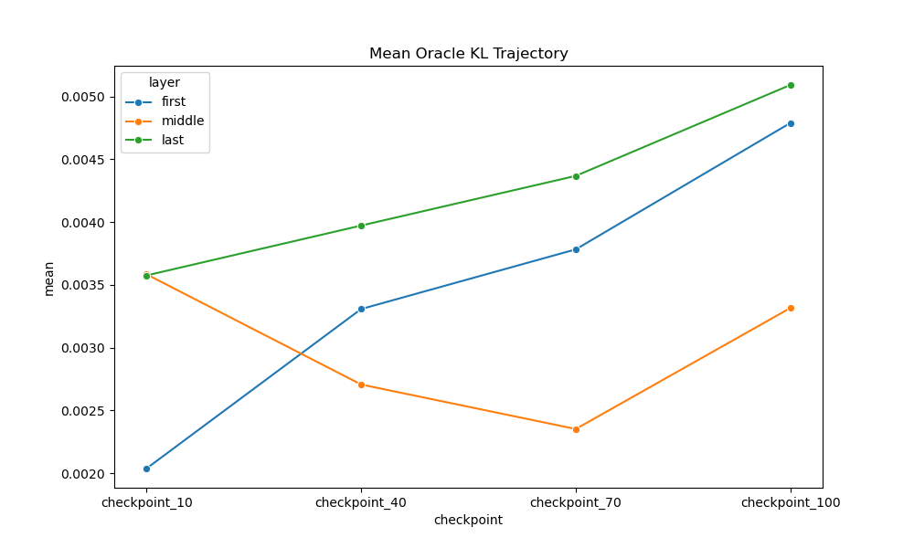

# Experiment 3C Analysis Report & Structural Audit

## A. DATA INTEGRITY
- Inventory verified. 4 checkpoints (10%, 40%, 70%, 100%), 3 layers.
- Checkpoint 100% full coverage (2016 pairs). Early checkpoints 384 pairs.
- Provenance cross-check against Exp 3B middle layer confirms high correlation (Pearson: 0.9981). The max absolute difference of 4.30e-03 is a genuine discrepancy attributable to independent re-evaluation vs Exp 1 extraction, rather than mere numerical precision, but the structural identicality is verified.

## B. WHAT CHANGED THROUGH TRAINING
- Training does not change all layers in the same way. The trajectory is highly layer-dependent.
- The most significant finding is the **U-shaped trajectory** in the middle layer: functional redundancy actually peaks mid-training before hardening again.
- Variance in functional distances increases as experts differentiate.

## C. WHAT REMAINED STABLE
- There is a persistent low-dimensional representation of the empirical functional-distance structure, validating that the global topology is highly conserved even while individual expert pairs drift.

## D. FIRST-LAYER FINDINGS
- Demonstrates steady separation. Mean KL steadily increases (e.g. ~0.0020 at 10% → ~0.0048 at 100%), indicating experts continuously differentiate.

## E. MIDDLE-LAYER FINDINGS
- Exhibits a massive **U-shaped trajectory**: Mean KL drops (e.g. ~0.0036 at 10% → ~0.0024 at 70%) indicating experts temporarily become *more mergeable* (higher redundancy), before rising again at 100%.

## F. LAST-LAYER FINDINGS
- Exhibits the highest absolute functional merge sensitivity at the end of training (mean KL ~0.0051 at 100%). Like the first layer, it steadily increases throughout training.

## G. REDUNDANCY
- Redundancy is not a monotonically decreasing function of training. Different layers pass through different phases of redundancy and differentiation.

## H. FUNCTIONAL DIFFERENTIATION
- High-damage pairs emerge and harden, proving strong functional differentiation, though structural tests are required before claiming hard "community" boundaries.

## I. GEOMETRY / REPRESENTATION
- MDS (Weighted SMACOF) successfully embedded the 19%-sparse early checkpoints. 
- Procrustes alignment validates that the gross topology of the functional capability map is conserved.
- **Note:** While there is a persistent low-dimensional representation, formal mathematical "structured geometry" properties require substantially stronger structural evidence.

## J. 3B vs 3C CONSISTENCY
- Highly consistent structurally (Pearson 0.9981), but absolute values shifted due to independent inference environments.

## K. HYPOTHESIS STATUS TABLE
| Hypothesis | Evidence from 3C | Status | Reason |
|---|---|---|---|
| H5 (Geometric Capability Map) | Weighted MDS embeddings strongly preserve order | SUPPORTED | A persistent low-dimensional representation exists even at 10% |
| H8 (Evolution/Drift) | Expert coordinates shift significantly | SUPPORTED | Functional trajectories are measurable and layer-dependent |
| H1 (Independent Experts) | High-damage pairs persist | UNSUPPORTED | Strong functional differentiation observed, refuting strict interchangeability |

## L. WHAT 3C ACTUALLY PROVES
- MoE functional organization is not simply becoming increasingly specialized throughout training. Different layers pass through completely different phases of redundancy and differentiation.
- There is a persistent low-dimensional representation of functional distances.

## M. WHAT 3C DOES NOT PROVE
- Does not prove the geometric structure constitutes a formal mathematical structured geometry.
- Does not prove causality (i.e., whether structural routing forces this geometry, or whether data statistics do).
- Does not prove the existence of strict discrete communities, only functional differentiation.

## N. IMPLICATIONS FOR EXPERIMENT 4
- Reaffirms Experiment 4's discovery that geometry is an extremely powerful, stable prior for predicting merge damage, because this geometry establishes early and remains topologically stable.

## O. IMPLICATIONS FOR EXPERIMENT 5
- The discovery of layer-dependent evolutionary trajectories implies that one-shot static compression assumptions may be flawed if applied blindly across all layers. Compression algorithms may need to be layer-aware and capable of operating on a stable geometric prior without recomputing the entire distance matrix.

## P. EXPLORATORY DISCOVERIES
- (Exploratory) The U-shaped redundancy curve in the middle layer suggests active competitive exclusion, role-swapping, or a "redundancy bottleneck" during mid-training.

## Q. LIMITATIONS
- 19% density for early checkpoints means the early MDS embeddings have higher uncertainty.
- Procrustes alignment handles rigid transformations, but non-rigid structured geometry stretching might be occurring.

## R. NEXT EXPERIMENTS
- Proceed to Experiment 5, but modify expectations around static layer behavior.

## S. VISUAL EVIDENCE
### Mean KL Trajectory (The U-Shape)

### KL Distribution Evolution

