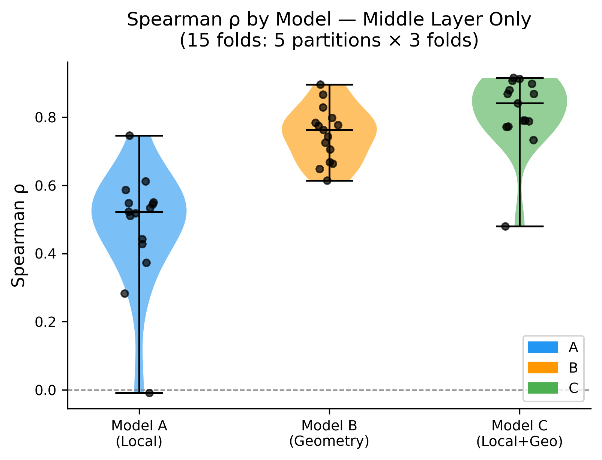
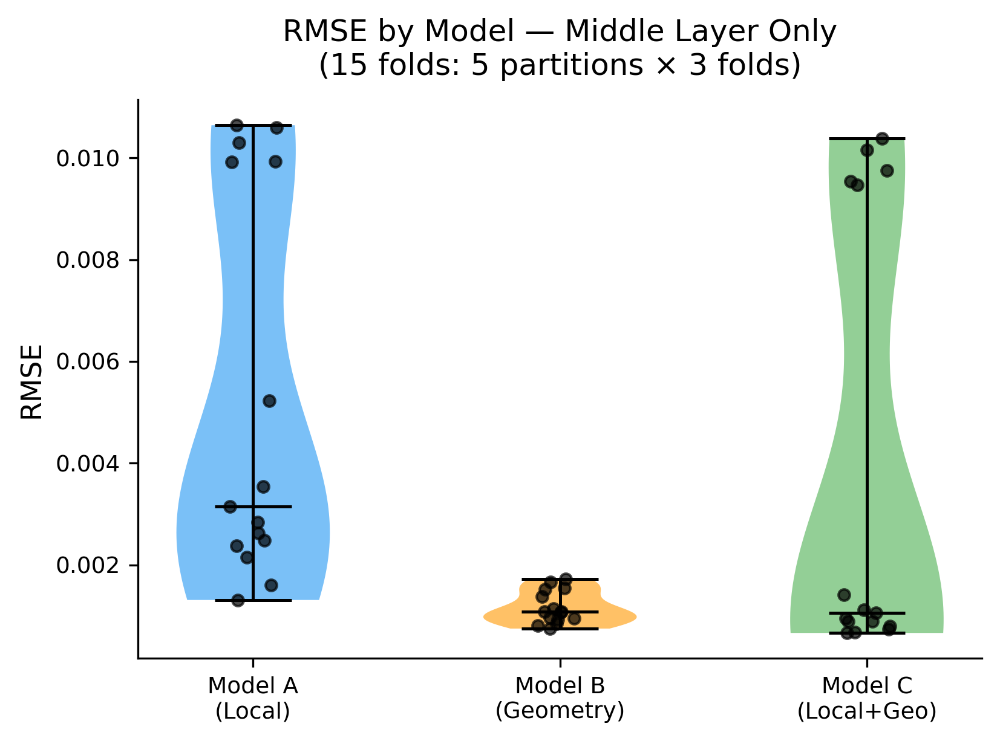
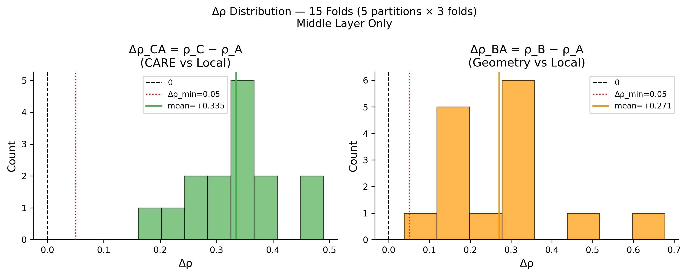
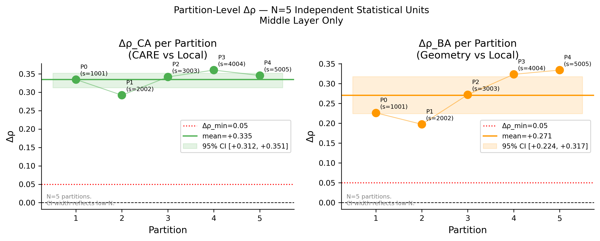
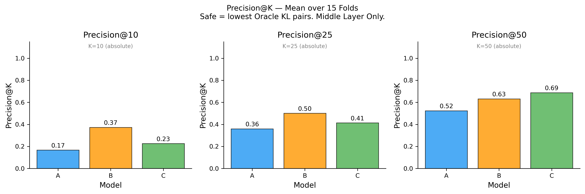

# CARE-MoE Experiment 4 — Final Report
## Functional Merge Landscape: Middle-Layer Only

> **Generated:** 2026-08-12T10:13:35Z

> [!IMPORTANT]
> All conclusions from Experiment 4 are explicitly **middle-layer-only**.
> Results must not be generalized to first or last layers without
> independent validation on those layers.

## Scientific Question

Does capability geometry contain predictive information about
functional merge damage that is not captured by existing local
pre-merge descriptors?

- **Target**: `Y_ij = Oracle_KL(i,j)` — validated Exp 3B middle-layer Oracle distances
- **Model A**: 11 local pre-merge features (XGBoost, retrained per fold)
- **Model B**: `||z_i - z_j||_2` in q=4 MDS space — **NOT a learned predictor**
- **Model C** (CARE): 11 local features + 1 geometry distance (XGBoost, retrained per fold)

## Data Sources

| Item | Value |
|---|---|
| Oracle matrix | `results/exp3b/oracle_distance_matrix_middle.csv` |
| Oracle matrix hash (SHA256) | `6e92b0d4fe690cfa8595350c8e68eb82df4ea4074f303389b38fd1ec5fd72d35` |
| Feature data | `results/exp1/output.json` (Seq_Len=512, Layer=middle) |
| Feature data hash (SHA256) | `60b422494392f4b65383d60f8352f085e62b28d1820acda5625c58df3a6f01c0` |
| n_experts | 64 |
| n_pairs | 2016 |
| Seq_Len | 512 (matches Exp 3B calibration) |

## Feature Audit

All 11 features retained from Exp 2 without modification.

| Feature | Locality | Flagged | Reason |
|---|---|---|---|
| Weight_Distance | pair_local | No |  |
| Weight_Cosine | pair_local | No |  |
| Activation_Similarity | pair_local | No |  |
| Output_Similarity | pair_local | No |  |
| Routing_Similarity | pair_local | No |  |
| Usage_Frequency | pair_local | No |  |
| Jaccard_Overlap | pair_local | No |  |
| Usage_Asymmetry | global_stats | ⚠ YES | Uses per-expert marginal usage (pre-merge routing only) |
| Routing_JSD_Proxy | pair_local | No |  |
| Routing_NPMI_Proxy | global_stats | ⚠ YES | Uses per-expert usage + global mean (pre-merge routing only) |
| Specialization_Diff | global_stats | ⚠ YES | Uses per-expert marginal usage (pre-merge routing only) |

> [!NOTE]
> Flagged features use pre-merge routing statistics aggregated over all 64 experts.
> They do NOT contain Oracle KL or post-merge information.
> They are retained unchanged per spec (no silent replacement).

## Cross-Validation Structure

- **5 independent partitions × 3-fold expert-disjoint CV = 15 folds**
- Unit of generalization: **expert** (not pair)
- Partition seeds: `[1001, 2002, 3003, 4004, 5005]`
- ~21–22 test experts per fold, ~42–43 training experts
- Train pairs: both experts in train set
- Test pairs: both experts in test set
- Cross pairs (one train, one test): **discarded**

## Model Definitions

### Model A — Local Baseline
- Algorithm: XGBoost (identical hyperparameters to Experiment 2)
- Features: 11 local pre-merge features
- Retrained from scratch in every fold
- RobustScaler fitted on training pairs only

### Model B — Geometry Only
> [!IMPORTANT]
> Model B is NOT a learned predictor.
> `prediction_B(i,j) = ||z_i - z_j||_2`
> The Euclidean distance between MDS embeddings IS the prediction.

- MDS: metric SMACOF, q=4, n_init=5, max_iter=3000
- OOS embedding: L-BFGS-B, n_restarts=5
- Training MDS uses ONLY train×train Oracle distances
- Test experts embedded using ONLY test→train distances
- test→test distances NOT used in embedding optimization

### Model C — CARE (Local + Geometry)
- Algorithm: XGBoost (same hyperparameters)
- Features: 11 local + 1 geometry distance = 12 total
- Retrained from scratch in every fold
- RobustScaler fitted on training pairs only (12 features)

## Geometry Provenance

- **q = 4** (fixed, pre-registered from Experiment 3B)
- q=4 was selected in Exp 3B as best-performing among q=2,4,6,8
- It was **performance-selected, not theoretically motivated**
- q was NOT re-tuned based on Experiment 4 results

## Pilot Status

**Status: PASS**

Two-partition integrity pilot ran before full experiment.
Code frozen after pilot pass. No methodology changes after this point.

## Leakage Checks

All 10 hard leakage rules enforced as automated assertions:

1. ✅ No test expert appears in training set
2. ✅ No test-test Oracle distance used to fit training MDS
3. ✅ No test-test distance used to optimize test-expert coordinate
4. ✅ Oracle target values do not enter feature construction
5. ✅ Model A retrained from scratch (not loaded from Exp 2)
6. ✅ Model C uses only pre-merge information
7. ✅ q not selected based on Experiment 4 results
8. ✅ Hyperparameters unchanged after pilot
9. ✅ Fold assignments unchanged between runs
10. ✅ All models use identical train/test expert splits

## All 15 Fold Results

| Partition | Fold | n_pairs | ρ_A | ρ_B | ρ_C | Δρ_BA | Δρ_CA |
|---|---|---|---|---|---|---|---|
| 0 | 0 | 231 | 0.5190 | 0.6486 | 0.7901 | +0.1296 | +0.2711 |
| 0 | 1 | 210 | 0.5454 | 0.7631 | 0.8799 | +0.2176 | +0.3344 |
| 0 | 2 | 210 | 0.3731 | 0.7052 | 0.7716 | +0.3321 | +0.3985 |
| 1 | 0 | 231 | 0.4430 | 0.6140 | 0.7331 | +0.1710 | +0.2901 |
| 1 | 1 | 210 | 0.5485 | 0.8292 | 0.8686 | +0.2807 | +0.3201 |
| 1 | 2 | 210 | 0.5230 | 0.6638 | 0.7888 | +0.1408 | +0.2658 |
| 2 | 0 | 231 | 0.5873 | 0.7747 | 0.9157 | +0.1874 | +0.3284 |
| 2 | 1 | 210 | 0.5340 | 0.8660 | 0.8691 | +0.3320 | +0.3351 |
| 2 | 2 | 210 | 0.4284 | 0.7253 | 0.7901 | +0.2968 | +0.3616 |
| 3 | 0 | 231 | 0.6123 | 0.7428 | 0.8411 | +0.1305 | +0.2288 |
| 3 | 1 | 210 | 0.2832 | 0.7778 | 0.7729 | +0.4946 | +0.4897 |
| 3 | 2 | 210 | 0.5504 | 0.8957 | 0.9127 | +0.3453 | +0.3623 |
| 4 | 0 | 231 | -0.0090 | 0.6682 | 0.4801 | +0.6772 | +0.4890 |
| 4 | 1 | 210 | 0.5111 | 0.7985 | 0.8979 | +0.2875 | +0.3869 |
| 4 | 2 | 210 | 0.7460 | 0.7839 | 0.9070 | +0.0379 | +0.1610 |

## Partition-Level Results (N=5 Independent Units)

> [!IMPORTANT]
> The 5 partitions are the independent statistical units.
> The 3 folds within each partition are correlated.
> Bootstrap CI reflects sampling variability over N=5 units only.
> These results must NOT be interpreted as high-power inference.

| Partition | Seed | ρ_A | ρ_B | ρ_C | Δρ_BA | Δρ_CA |
|---|---|---|---|---|---|---|
| 0 | 1001 | 0.4792 | 0.7056 | 0.8139 | +0.2264 | +0.3347 |
| 1 | 2002 | 0.5048 | 0.7023 | 0.7968 | +0.1975 | +0.2920 |
| 2 | 3003 | 0.5166 | 0.7887 | 0.8583 | +0.2721 | +0.3417 |
| 3 | 4004 | 0.4820 | 0.8054 | 0.8422 | +0.3235 | +0.3603 |
| 4 | 5005 | 0.4160 | 0.7502 | 0.7617 | +0.3342 | +0.3456 |

## Final Statistics

| Metric | Mean | Median | 95% CI |
|---|---|---|---|
| ρ_A | +0.4797 | +0.4820 | [+0.4464, +0.5050] |
| ρ_B | +0.7504 | +0.7502 | [+0.7132, +0.7877] |
| ρ_C | +0.8146 | +0.8139 | [+0.7848, +0.8430] |
| Δρ_BA | +0.2707 | +0.2721 | [+0.2240, +0.3175] |
| Δρ_CA | +0.3349 | +0.3417 | [+0.3119, +0.3515] |

*N=5 independent partition-level effects. Bootstrap CI reflects sampling variability over 5 units only. Results must NOT be interpreted as high-power inference.*

**Wilcoxon signed-rank (Δρ_BA > 0):** stat=15.0, p=0.0312 (secondary descriptive, n=5, low power)
**Wilcoxon signed-rank (Δρ_CA > 0):** stat=15.0, p=0.0312 (secondary descriptive, n=5, low power)

## Noise Ceiling

**Status: SKIPPED**

No genuine repeated Oracle measurements available. Multi-Seq_Len values are not independent replicates. Noise ceiling will be reported as SKIPPED.

## Decision Gate

**Pre-registered threshold:** Δρ_min = 0.05

| Case | Description | Result |
|---|---|---|
| A | Geometry fails (Δρ_BA < 0.05 or CI includes 0) | FALSE |
| B | Geometry adds value / **H10 survives** | TRUE |
| C | Geometry dominates | TRUE |
| D | Geometry complementary (B fails, C succeeds) | FALSE |
| E | Geometry subsumes local | FALSE |

### H10 Verdict: **SURVIVES**

Geometry adds predictive information beyond local pre-merge features.
Geometry earns the right to be used in the next compression experiment.

## Scope and Limitations

> [!WARNING]
> **All conclusions are explicitly middle-layer-only.**
> No claims are made about first or last layers.
> No compression simulation has been run.
> Differential geometry (Jacobian, Hessian, etc.) has not been computed.
> Graph/topology features have not been included.

- N=5 partition-level observations; bootstrap CI has limited power
- Noise ceiling unavailable (no repeated Oracle measurements)
- q=4 was performance-selected in Exp 3B (not theoretically motivated)
- 3 of 11 features use global routing statistics (flagged, pre-merge only)

## Visual Evidence & Diagrams

### 1. Spearman Correlation by Model

*Shows the massive rank-correlation advantage of Geometry (B) and the CARE model (C) over the Local Baseline (A).*

### 2. RMSE by Model

*Demonstrates a corresponding sharp decrease in absolute prediction error when geometric features are utilized.*

### 3. Delta Rho Distribution

*Highlights the stability of the geometry advantage (Δρ) across all 15 folds, consistently exceeding the 0.05 threshold.*

### 4. Partition-Level Delta Rho

*Displays the bootstrap confidence intervals for the 5 independent statistical partitions.*

### 5. Precision @ K

*Confirms that Model C (CARE) correctly identifies the most catastrophic merges in the top 10, 25, and 50 pairs.*
