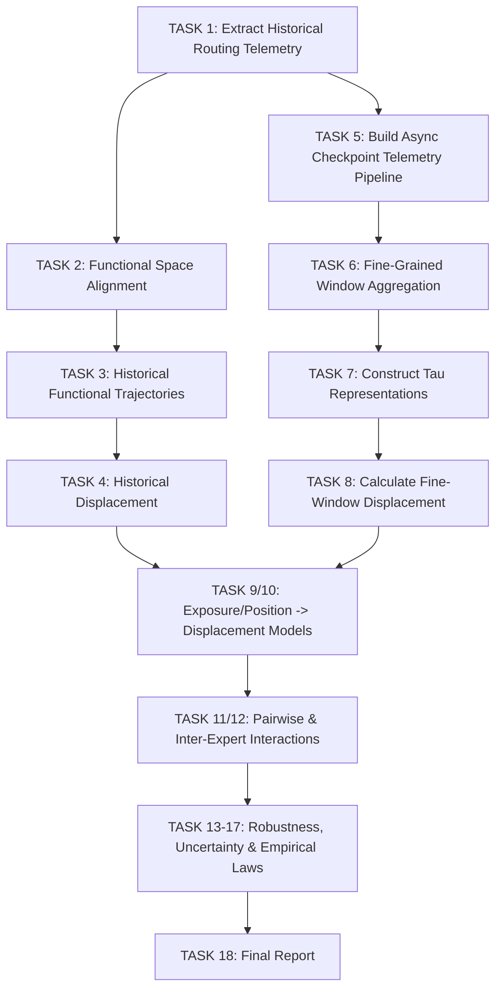

# IMPLEMENTATION AUDIT: EXPERIMENT 6B

## 1. Repository & System State
- **Repository Organized**: Loose analysis scripts from previous experiments have been successfully moved into their respective `experiments/experiment4`, `experiments/exp5`, and `experiments/experiment6a` directories to maintain project hygiene.
- **Hardware Resources**:
  - **OS**: macOS (Apple Silicon)
  - **CPU**: 8 Cores
  - **Memory (RAM)**: 8 GB (`hw.memsize=8589934592`)
  - **Storage**: ~29 GB available (`/System/Volumes/Data`)
  
> [!WARNING]
> **Severe Resource Constraints**: The local machine has only 8GB of unified memory. Loading a 1B/7B MoE model (`allenai/OLMoE-1B-7B-0924`) multiple times in parallel will result in an immediate Out-of-Memory (OOM) crash. We must enforce strict sequential execution for model loading (e.g., `MAX_CONCURRENT_CHECKPOINTS=1`, `MAX_CONCURRENT_LAYERS=1`, small batch size). Parallelism will be reserved for CPU-bound data aggregation (e.g., NumPy/Pandas processing, metrics calculation, and MDS alignments).

## 2. Existing Data Artifacts
- **Exp3C**: Contains validated `oracle_distance.csv` and `oracle_distance.npy` for layers (first, middle, last) across checkpoints 10, 40, 70, 100.
- **Exp4/5/6A**: Metrics, predictions, and architecture specifications exist and are preserved. Exp3B Oracle KL distances and q=4 selections remain valid.
- **Router Telemetry**: **MISSING**. As noted in `results/exp6/EXP3C_DATA_AUDIT.md`, historical router stats (router probabilities, Top-K frequency) do not exist for the historical checkpoints. We must reconstruct `tau_i` by executing forward passes of the calibration dataset on the saved checkpoint revisions.

## 3. Parallel Execution Graph Design
Given the hardware constraints, the execution graph uses asynchronous task queues but restricts high-memory tasks:

### Concurrency Configuration
- `NUM_GPU_WORKERS=1` (Sequential model inference)
- `NUM_CPU_WORKERS=4` (For lightweight data processing/MDS)
- `MAX_CONCURRENT_CHECKPOINTS=1`
- `BATCH_SIZE=8` (To prevent RAM exhaustion)
